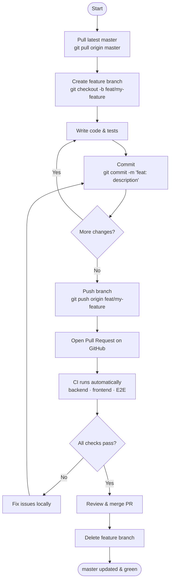
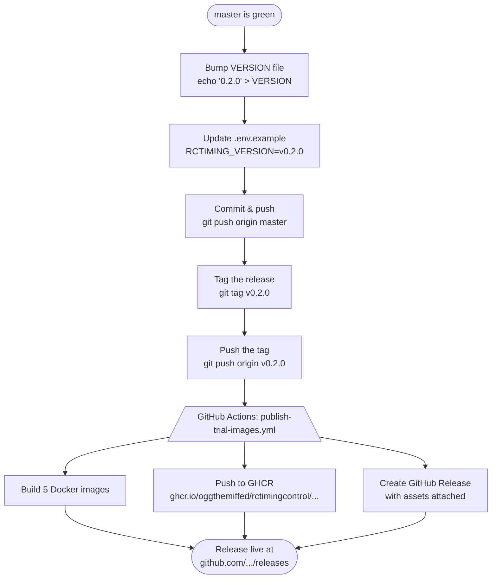
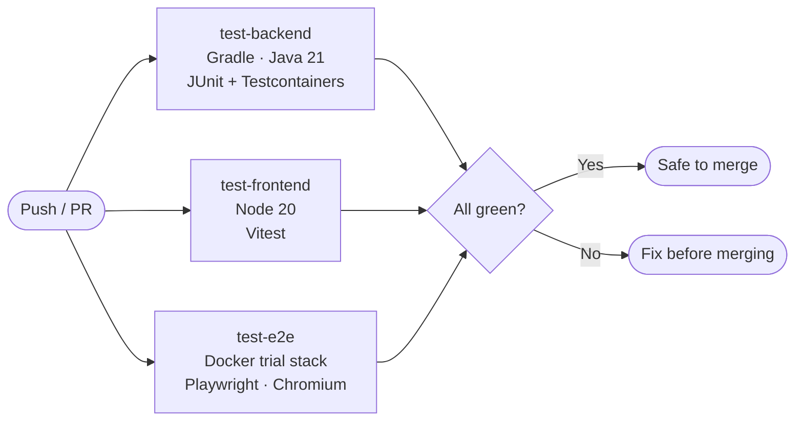

# Contributing & Development Workflow

## Recommended workflow

Work happens on **feature branches**. `master` is always green and deployable — direct pushes are discouraged (see [branch protection](#optional-branch-protection) below).

```
master  ─────────────────────────────────────────────────────► always deployable
              ↑           ↑              ↑
         PR merged    PR merged      PR merged
              │           │              │
feat/login ──►          feat/timing ──►    fix/seed-bug ──►
```

---

## Day-to-day development



### Branch naming

| Type | Pattern | Example |
|------|---------|---------|
| New feature | `feat/<description>` | `feat/championship-pdf-export` |
| Bug fix | `fix/<description>` | `fix/seed-duplicate-transponder` |
| Documentation | `docs/<description>` | `docs/forwarder-setup-guide` |
| Chore / tooling | `chore/<description>` | `chore/bump-spring-boot-3.5` |

### Commit messages

This repo uses [Conventional Commits](https://www.conventionalcommits.org/):

```
feat: add PDF export for championship standings
fix: forwarder reconnects on WATCHDOG timeout
docs: update forwarder setup guide
chore: upgrade Spring Boot to 3.5.0
test: add E2E test for race control login
```

---

## Release workflow

Releases are **tag-driven**. Pushing a `v*` tag triggers CI to build Docker images, push them to GHCR, and create a GitHub Release automatically.



**Full checklist:** see [RELEASES.md](RELEASES.md)

---

## CI pipeline

Three jobs run on every push and pull request:



| Job | What it tests | Approx time |
|-----|--------------|-------------|
| `test-backend` | JUnit 5 + Testcontainers — API, domain logic, timing | 3–5 min |
| `test-frontend` | Vitest — React components, hooks, utilities | < 1 min |
| `test-e2e` | Playwright — full Docker trial stack, 13 smoke tests | 8–12 min |

Playwright reports are uploaded as a GitHub Actions artifact on every run (retained 14 days).

---

## Optional: branch protection

To enforce this workflow automatically, enable branch protection on `master`:

1. Go to `https://github.com/oggthemiffed/RCTimingControl/settings/branches`
2. Click **Add rule** → Branch name pattern: `master`
3. Enable:
   - **Require a pull request before merging**
   - **Require status checks to pass** → select `test-backend`, `test-frontend`, `test-e2e`
   - **Require branches to be up to date before merging**
4. Save

This blocks any direct push to `master` and prevents merging a PR with failing CI. It is optional for solo work but strongly recommended once a second person contributes.

---

## Local test commands

```bash
# Backend tests (requires Docker for Testcontainers)
./gradlew :app:test :forwarder:test

# Frontend unit tests
cd frontend && npm test

# E2E tests (requires the trial stack to be running on localhost)
cp .env.example .env
docker compose -f docker-compose.trial.yml up -d
cd frontend && npm run test:e2e

# Interactive Playwright UI (great for writing new tests)
cd frontend && npm run test:e2e:ui
```

---

## Further reading

- [Development guide](docs/development.md) — local environment setup, Makefile reference
- [Architecture](docs/architecture.md) — module structure and design decisions
- [RELEASES.md](RELEASES.md) — release and hotfix process
- `docs/local-github-setup.md` — one-time GHCR configuration (local file, not in repo — see your local copy)
