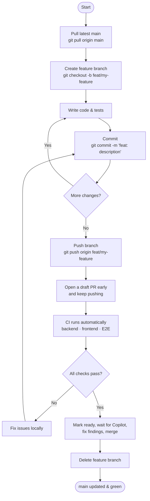
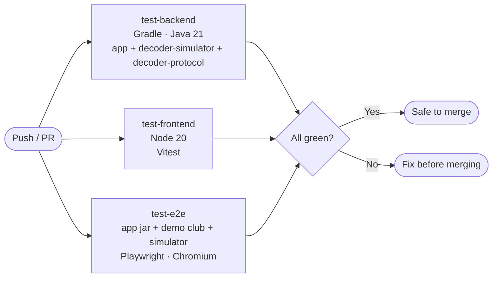

# Contributing & Development Workflow

## Recommended workflow

Work happens on **feature branches**. `main` is always green and releasable, and changes reach it through pull requests.

```
main  ─────────────────────────────────────────────────────► always deployable
              ↑           ↑              ↑
         PR merged    PR merged      PR merged
              │           │              │
feat/login ──►          feat/timing ──►    fix/seed-bug ──►
```

---

## Pull requests

Every PR follows the same steps:

1. **Open it as a draft early**, linked to its issue: first thing, or straight after your first change.
2. **Commit and push small changes often**, so progress shows on the PR.
3. **Mark it ready for review only when it's done**: the issue's acceptance is met and CI is green.
4. **Wait for Copilot's review.** Request one if it isn't triggered automatically. Fix and push important findings (bugs, security issues, broken behaviour, missed acceptance criteria), and reply to each Copilot comment saying it's fixed or why it stays as is.
5. **Merge only when that's done** and CI is green again.

---

## Day-to-day development


```mermaid
flowchart TD
    A([Start]) --> B[Pull latest main\ngit pull origin main]
    B --> C[Create feature branch\ngit checkout -b feat/my-feature]
    C --> D[Write code & tests]
    D --> E[Commit\ngit commit -m 'feat: description']
    E --> F{More changes?}
    F -- Yes --> D
    F -- No --> G[Push branch\ngit push origin feat/my-feature]
    G --> H[Open a draft PR early\nand keep pushing]
    H --> I[CI runs automatically\nbackend · frontend · E2E]
    I --> J{All checks pass?}
    J -- No --> K[Fix issues locally]
    K --> E
    J -- Yes --> L[Mark ready, wait for Copilot,\nfix findings, merge]
    L --> M[Delete feature branch]
    M --> N([main updated & green])
```

### Branch naming

| Type | Pattern | Example |
|------|---------|---------|
| New feature | `feat/<description>` | `feat/championship-pdf-export` |
| Bug fix | `fix/<description>` | `fix/seed-duplicate-transponder` |
| Documentation | `docs/<description>` | `docs/decoder-setup-guide` |
| Chore / tooling | `chore/<description>` | `chore/bump-spring-boot-3.5` |

### Commit messages

This repo uses [Conventional Commits](https://www.conventionalcommits.org/):

```
feat: add PDF export for championship standings
fix: decoder reconnects on WATCHDOG timeout
docs: update decoder setup guide
chore: upgrade Spring Boot to 3.5.0
test: add E2E test for race control login
```

---

## CI pipeline

Three jobs run on every push and pull request:


```mermaid
flowchart LR
    Push([Push / PR]) --> B[test-backend\nGradle · Java 21\napp + decoder-simulator + decoder-protocol]
    Push --> C[test-frontend\nNode 20\nVitest]
    Push --> D[test-e2e\napp jar + demo club + simulator\nPlaywright · Chromium]

    B --> E{All green?}
    C --> E
    D --> E

    E -- Yes --> F([Safe to merge])
    E -- No --> G([Fix before merging])
```

| Job | What it tests | Approx time |
|-----|--------------|-------------|
| `test-backend` | JUnit 5 on temporary SQLite databases (no Docker) — API/domain/timing, plus `decoder-simulator` and `decoder-protocol` | 3–6 min |
| `test-frontend` | Vitest — React components, hooks, utilities | < 1 min |
| `test-e2e` | Playwright smoke tests against the app jar with the UI inside, the demo club and the simulator | 5–8 min |

Playwright reports are uploaded as a GitHub Actions artifact on every run (retained 14 days) as `playwright-report`.

---

---

## Local test commands

```bash
# Backend tests (no Docker needed)
./gradlew :app:test :decoder-simulator:test

# Decoder protocol parser tests (no Docker)
./gradlew :decoder-protocol:test

# Frontend unit tests
cd frontend && npm test

# E2E tests: start the app with the demo club and the simulator (see docs/development.md,
# "Trying it out with the demo club"), then
cd frontend && BASE_URL=http://localhost:8080 npm run test:e2e

# Interactive Playwright UI (great for writing new tests)
cd frontend && npm run test:e2e:ui
```

---

## Further reading

- [Development guide](docs/development.md) — local environment setup, Makefile reference
- [Architecture](docs/architecture.md) — module structure and design decisions
- [RELEASES.md](RELEASES.md) — upgrade notes for each release
