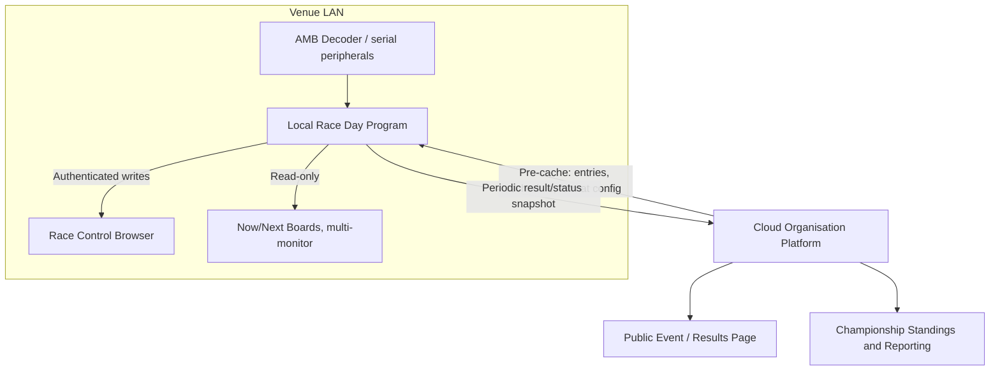

# Architecture

> This document covers the cloud application (`app/`, `frontend/`, `forwarder/`, `decoder-protocol/`). For the independent Local Race Day Program (`localday/`, `frontend-local/`), see [Local Race Day Program (split architecture)](#local-race-day-program-split-architecture) below.

## Overview

Modular monolith — one Spring Boot process, single PostgreSQL database, single deployment. The complexity of a distributed system isn't warranted for single-club RC venue scale.

```
┌─────────────────────────────────────────────────┐
│                 Spring Boot App                 │
│                                                 │
│  ┌──────────────┐  ┌──────────────────────────┐ │
│  │  REST APIs   │  │   WebSocket / STOMP      │ │
│  │  /api/v1/    │  │   (live timing hub)      │ │
│  └──────┬───────┘  └──────────────────────────┘ │
│         │                                       │
│  ┌──────▼──────────────────────────────────┐    │
│  │           Domain Core                   │    │
│  │  JPA entities · services · repositories │    │
│  └──────┬──────────────────────────────────┘    │
│         │                                       │
│  ┌──────▼────────────┐  ┌───────────────────┐   │
│  │  Flyway migrations│  │  jOOQ read queries │   │
│  │  (schema owner)   │  │  (scoring, results)│   │
│  └───────────────────┘  └───────────────────┘   │
└─────────────────────┬───────────────────────────┘
                      │
              PostgreSQL 16
```

## Key design decisions

### CQRS-lite split

The domain module owns all writes via Hibernate/JPA. A separate query module (planned Phase 4+) uses jOOQ for read-side projections — scoring calculations, standings, lap aggregates. **Hibernate sessions never cross into the query module; jOOQ never lazy-loads.** This boundary is enforced by package structure, not a framework.

### JWT authentication

Stateless — no server-side session. Access tokens (15-min TTL) are returned in the response body. Refresh tokens (7-day TTL) are stored in an HttpOnly cookie scoped to `/api/v1/auth/refresh` only, preventing JavaScript access. Token rotation on every refresh. Only officials (`ADMIN`, `RACE_DIRECTOR`, `REFEREE`) can sign in or refresh; anyone else gets 403.

### Race format config (JSONB)

Format configurations are stored as JSONB in PostgreSQL using Hypersistence Utils. The Java type is a sealed interface (`RaceFormatConfig`) with three record subtypes (`TimedRaceConfig`, `BumpUpConfig`, `PointsFinalsConfig`). Jackson's `@JsonTypeInfo` on the interface provides polymorphic serde. A `type` discriminator column on the table enables SQL-side filtering without deserializing the blob.

Override patches (FORMAT-07) are stored in a second `configOverride` JSONB column and merged at read time — base config from the template snapshot, patches applied on top. Template edits do not affect existing event classes (snapshot-at-assignment, FORMAT-06).

### Race state machine

`PENDING → GRID → RUNNING → STOPPED → RUNNING` (resume) or `RUNNING → FINISHED`. Invalid transitions return HTTP 409. Live race positions are **never persisted during a race** — calculated in memory, broadcast over STOMP, persisted only as a final result snapshot on `FINISHED`.

### TCP decoder

The AMB/MyLaps decoder client runs on a dedicated background thread (Netty 4.1, `SmartLifecycle`), completely isolated from the Tomcat thread pool. Parsed `LapPassingEvent`s are posted via `ApplicationEventPublisher` (async listener) to avoid blocking the decoder thread. Protocol parsing itself (`RC4TextParser`, `EpochAnchor`, `SeqGapDetector`, the P3 binary decoder) lives in the shared `decoder-protocol/` module, used by both `forwarder/` (cloud path) and `localday/` (local race day path) — see [Local Race Day Program](#local-race-day-program-split-architecture) below.

## STOMP topics

| Topic | Content |
|-------|---------|
| `/topic/race/{raceId}/timing` | Live lap passings, positions, gaps |
| `/topic/race/{raceId}/state` | Race lifecycle changes |
| `/topic/race/{raceId}/marshal` | Marshal lap adjustments |

## Roles

Only officials have accounts. Their roles are stackable — one account can hold any combination:

| Role | Permissions |
|------|-------------|
| `ADMIN` | Club config, user management, event setup |
| `RACE_DIRECTOR` | Race control client — start/stop, grid calls, marshal laps |
| `REFEREE` | Penalties, transponder linking, incident reports |
| Competitors | No account: entries come from the RaceHub import or are added as walk-ins |
| Anonymous | Event schedule, live timing, results, standings |

## Phase roadmap

All ten phases are complete — see the [README](../README.md#whats-implemented) for the current feature-area breakdown.

---

## Local Race Day Program (split architecture)

`localday/` + `frontend-local/` is a **second, independent application** — not a module of the cloud app above, and sharing no code or UI with it (aside from `decoder-protocol/`'s pure protocol parser). It exists to answer a gap the cloud-only design above cannot: a venue network outage during a meeting takes race control down with it, because race control runs entirely server-side on the cloud and live positions are in-memory-only by design.

Full requirements, decision rationale, and the prior (superseded) hybrid design this replaces are in `docs/plans/2026-08-06-001-feat-offline-race-day-resilience-split-plan.md`. Summary:



**Key decisions:**

- **Two independent products, not a hybrid.** The cloud stays authoritative for event/championship organization (entries, schedule, format config). `localday/` is its own Spring Boot backend with its own embedded PostgreSQL (no Docker, no external database — durability across an unclean shutdown is exactly why embedded Postgres was chosen over H2), and `frontend-local/` is its own React frontend. Nothing is shared between the two codebases except `decoder-protocol/`'s pure `byte[] → LapPassingEvent` parser.
- **Cloud hands off authority at day-open, local is sole authority for the day.** An official pre-caches an event's entries/schedule/format config and officials' local-login credentials while still connected, then opens the day. From that point `localday/` never depends on the cloud to keep running — check-in, race control (start/stop/grid/marshal adjustments, multi-round grid progression), decoder ingestion, and the anonymous spectator boards all work with zero connectivity. (Bump-up/finals promotion across a class's qualifying standings is implemented as a service but not yet wired to an endpoint — see LOCALDAY-06 in `docs/REQUIREMENTS.md`.)
- **Periodic snapshots, not fine-grained mirroring.** While connected, `localday/` pushes result/status snapshots to the cloud on a short interval (laps, results, standings, current heat/next-up) rather than replicating every race-control action. The cloud always recomputes final standings itself from synced raw laps/results — a synced snapshot is provisional.
- **Local session auth, not a shared credential.** Officials log in locally using a pre-cached, day-scoped credential — not a copy of their cloud login. Device loss is a manual official declaration (gated to the cloud `ADMIN` role), not automatic detection; the cloud rejects a superseded device's snapshot via a generation-fencing check rather than cryptographic revocation.

**Module/component map:**

| Component | Responsibility |
|-----------|----------------|
| `decoder-protocol/` | Shared, Spring-free AMB RC-4 text + P3 binary protocol parsing. Used by both `forwarder/` and `localday/`. |
| `localday/` | Independent Spring Boot backend: embedded PostgreSQL, local auth, check-in, race-control state machine + grid progression, decoder ingestion, live timing, anonymous boards, periodic cloud sync. |
| `frontend-local/` | Independent React frontend: officials' race-control cockpit, check-in desk, multi-monitor now/next + results boards. |
| `app/` (additions) | Cloud-side day-lifecycle lock/unlock, pre-cache endpoint, snapshot ingest with generation fencing, device-loss declaration, public-page delay/incomplete-data indicators. |

**Operator guidance:** never run `forwarder/` and `localday/` against the same decoder at the same venue — see [docs/forwarder.md](forwarder.md#local-race-day-program-exclusivity). Dev/test setup for this module is in [docs/development.md](development.md#local-race-day-program-localday--frontend-local); its test matrix is in [docs/testing.md](testing.md#local-race-day-program-localday--frontend-local--decoder-protocol).
