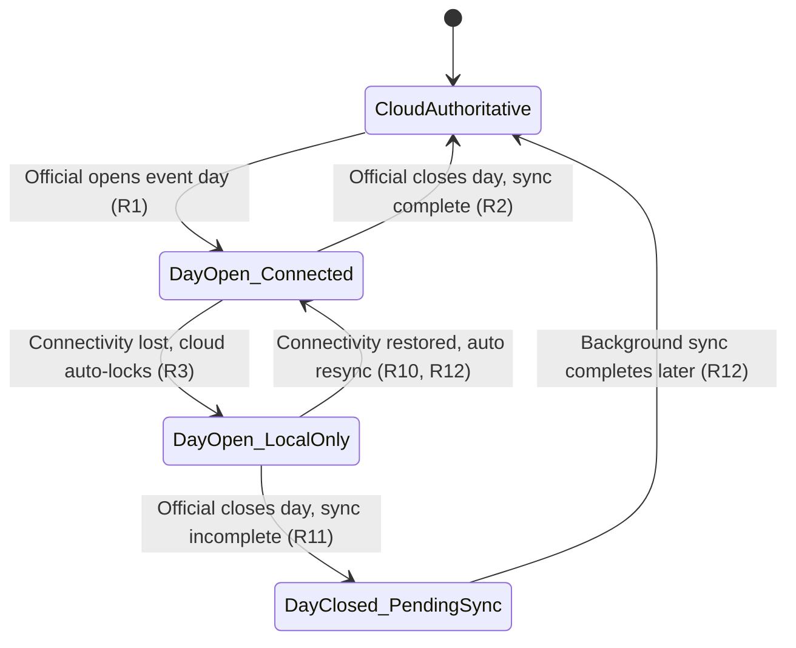
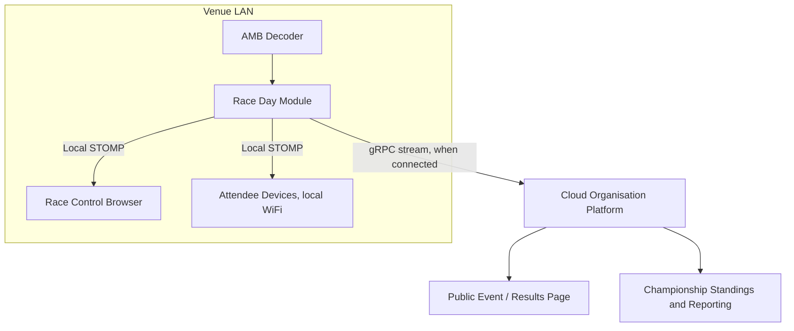

# Offline Race-Day Resilience - Plan

## Goal Capsule

- **Objective:** Design offline-resilient race-day operation for RC Timing Control so a venue can run a complete meeting — check-in through results — with zero internet for hours or a full day, while the cloud remains authoritative for everything outside race day.
- **Product authority:** This plan owns the offline / race-day-resilience decision. Racer self-service, event and championship administration, and cross-club reporting remain cloud-owned and are not active scope here, except where this plan defines the handoff of authority to and from them.
- **Open blockers:** None block planning. Two implementation-level choices are deferred to `ce-plan` (see Outstanding Questions).

## Product Contract

### Summary

Split the system into two products with a daily handoff of authority: the cloud stays authoritative for everything before and after race day (event and championship setup, registration, profiles, performance reporting), while a small, API-first **Race Day Module** — extending the forwarder already installed at every venue — becomes authoritative for running the event once an official explicitly opens it each day. The module owns check-in, race control, timing, and local LAN visibility for attendees; it syncs continuously to the cloud whenever connectivity allows and hands authority back when the day closes.

### Problem Frame

Internet at the venue has already gone down mid-meeting at real regional-championship and nationals events, taking lap recording with it. These are exactly the meetings where the system can least afford to fail: high entry counts, tight schedules, and hundreds of people moving through scrutineering who need to see what heat is running.

The current architecture cannot absorb that failure. It is a single cloud-hosted modular monolith: the forwarder (the only component that runs at the venue today) merely relays raw decoder data to the cloud over gRPC, and race control — the state machine, grid calls, marshal adjustments — runs entirely server-side. Live race positions are already in-memory-only by design, so a network drop mid-race doesn't just interrupt the timing feed, it removes race control's ability to function at all. The forwarder's existing resilience is connection-level only (decoder reconnect with backoff, gRPC stream reconnect, WATCHDOG heartbeat detection); nothing buffers or persists timing data during an outage, and RESEND (replay of missed passings) is a documented stub with no working implementation for the RC-4 text protocol clubs actually run. `docs/REQUIREMENTS.md` currently lists "Offline mode" as explicitly out of scope for v1 — this plan proposes reversing that.

### Key Decisions

- **KD1. Local authority is triggered by an explicit official action (open/close event day), with automatic cloud-side lockout only as a mid-day safety net if connectivity fails before an explicit close.** (session-settled: user-directed — chosen over a fully automatic detect-and-failover trigger: removes split-brain ambiguity between cloud and venue while still protecting against failure mid-day.) Governs R1, R2, R3.
- **KD2. Each event day is opened and closed independently; multi-day continuous local sessions are out of scope for now.** (session-settled: user-directed — chosen over carrying local authority across a whole multi-day event: treated as future/low-likelihood work, since clubs can usually recover connectivity via mobile hotspot within a day.) Governs R4.
- **KD3. The Race Day Module is scoped to event-day operations only (check-in, race control, timing, local results) rather than replicating full admin capability locally.** (session-settled: user-directed — chosen over running the full cloud application at the venue: sidesteps future multi-tenancy complications if the cloud comes to host multiple clubs, and keeps the local install light.) Governs R5, R6, R8.
- **KD4. The Race Day Module is a Java service extending the existing forwarder, serving the existing React frontend, rather than a native desktop application.** (session-settled: user-directed — chosen over a native WinForms/C# app: avoids Windows-only lock-in and a second permanent UI stack to maintain; API-first design leaves room for a richer native front-end later if actually wanted.) Governs R6, R7.
- **KD5. Durable local buffering of raw lap passings is a foundation layer, needed regardless of the rest of this work.** (session-settled: user-approved — proposed as a cheap, high-value fix to the existing unimplemented RESEND gap; user agreed it's required either way.) Governs R9.
- **KD6. Sync from venue to cloud is continuous and opportunistic rather than batched at end-of-day, with an explicit close-time completeness check that warns rather than silently assuming success.** (session-settled: user-directed — ensures data flows "as soon as possible" and surfaces an incomplete sync instead of hiding it.) Governs R10, R11, R12.
- **KD7. The venue proactively pre-caches the day's entries, schedule, and format config during setup, rather than assuming connectivity at the moment racing starts.** (session-settled: user-directed) Governs R13.
- **KD8. The public cloud event page stays reachable during a venue outage, showing possibly-stale data with an outage indicator, rather than needing to reflect live data in real time.** (session-settled: user-directed) Governs R14.

### Actors

- **Race official** — opens and closes the event day, runs race control, performs check-in and transponder reassignment at the venue.
- **Attendee / spectator (venue)** — views live timing, current heat, schedule, and results over the venue's local network, connectivity-independent.
- **Racer** — pre-entered via the cloud portal ahead of the event; unaffected by venue connectivity during the meeting itself.
- **Cloud Organisation Platform** (system) — authoritative for event/championship setup, registration, profiles, and reporting; authoritative for race-day data once it re-syncs after a day closes.
- **Race Day Module** (system) — authoritative for a single venue's single event day once opened; extends the existing forwarder.

### Requirements

**Authority & lifecycle**

- R1. An official can explicitly open an event day at the venue, which hands race-control authority for that day to the Race Day Module.
- R2. An official can explicitly close an event day once racing concludes, which checks sync completeness and hands authority back to the cloud.
- R3. If the venue loses connectivity to the cloud while a day is open and has not been explicitly closed, the cloud automatically locks out edits to that event as a safety net, and the Race Day Module continues operating as sole authority until connectivity returns.
- R4. Each event day is opened and closed independently; the Race Day Module is not required to preserve local authority continuously across multiple calendar days.

**Race Day Module scope**

- R5. The Race Day Module supports check-in / attendance confirmation for pre-entered racers at the venue, independent of cloud connectivity.
- R6. The Race Day Module runs the full race-control workflow locally — race state machine (start/stop/grid/marshal adjustments), live timing ingestion from the decoder, and live position/results display — with no reduced or different UI compared to the cloud-connected experience.
- R7. The Race Day Module serves live timing, current heat/race, schedule, and results over the venue's local network, so attendees on local WiFi can view them without internet.
- R8. Officials can reassign a transponder to an existing entry locally during the event (e.g., for equipment failure) without needing cloud connectivity.

**Sync & data integrity**

- R9. The Race Day Module durably persists lap passings locally as they're captured, independent of cloud transmission, so a network interruption never loses captured lap data.
- R10. While connectivity exists, the Race Day Module continuously streams race-day data (state transitions, laps, marshal adjustments, results) to the cloud in the background, rather than batching until end-of-day.
- R11. When an official closes the event day and not all local data has synced, the system warns the official and continues attempting the sync later (including from a different location) rather than reporting the close as fully complete.
- R12. When connectivity resumes after an interruption, previously-unsent race-day data flows to the cloud automatically, with no manual export/import step from officials.

**Pre-event setup**

- R13. Before an event day is opened, the Race Day Module can pre-cache that day's entries, schedule, and race format configuration while still connected, so it can operate independently even if connectivity is lost before the first race.

**Cloud & public visibility**

- R14. The public-facing cloud event/results page remains reachable during a venue outage, showing the most recently synced data along with an indication that live data may be delayed.

### Key Flows

- F1. **Open event day**
  - **Trigger:** Official starts setup at the venue before racing begins.
  - **Actors:** Race official, Cloud Organisation Platform, Race Day Module
  - **Steps:** Official logs in locally and selects the scheduled event → module pulls or confirms cached entries/schedule/format config → local authority for the day begins.
  - **Covers:** R1, R13

- F2. **Run races through a mid-day outage**
  - **Trigger:** Connectivity is lost while a day is open.
  - **Actors:** Cloud Organisation Platform, Race Day Module, Race official, Attendees
  - **Steps:** Cloud detects lost contact → cloud auto-locks edits to the event (R3) → Race Day Module continues running races, capturing laps locally, and serving the local LAN view uninterrupted.
  - **Covers:** R3, R6, R7, R9

- F3. **Reconnect and resync**
  - **Trigger:** Connectivity is restored.
  - **Actors:** Race Day Module, Cloud Organisation Platform
  - **Steps:** Race Day Module streams buffered and new race-day events to the cloud → cloud reconciles and unlocks the event → public event page reflects the caught-up state.
  - **Covers:** R10, R12, R14

- F4. **Close event day**
  - **Trigger:** Official ends racing for the day.
  - **Actors:** Race official, Race Day Module, Cloud Organisation Platform
  - **Steps:** Official issues the close action → system checks sync completeness → if complete, authority returns to the cloud; if incomplete, the official is warned and background sync continues (including from elsewhere later).
  - **Covers:** R2, R11

### Diagrams

**Operational states across a race day:**



**Venue vs. cloud data flow (extends the existing forwarder shown in `docs/architecture.md`):**



**Open-through-close sequence for a single event day:**

```mermaid
sequenceDiagram
    participant Off as Official
    participant RDM as Race Day Module
    participant Cloud as Cloud Platform
    Off->>RDM: Open event day
    RDM->>Cloud: Confirm cached entries, schedule, config
    Note over RDM: Connectivity lost
    RDM->>RDM: Persist laps and race events locally
    Note over RDM: Connectivity restored
    RDM->>Cloud: Stream buffered and new events
    Cloud-->>RDM: Acknowledge, unlock event
    Off->>RDM: Close event day
    RDM-->>Off: Confirm fully synced, or warn pending
```

### Acceptance Examples

- AE1. **Covers R3.** Given an event day is open and the venue loses connectivity mid-race, When the cloud detects lost contact, Then the cloud automatically locks out edits to that event for cloud-side users, and the Race Day Module keeps running the race locally without interruption.
- AE2. **Covers R2, R11.** Given an official closes the event day, When not all local data has synced to the cloud yet, Then the official is warned that a final sync is still pending, and the system keeps attempting it in the background, including from a different location later.
- AE3. **Covers R14.** Given a venue is mid-outage, When a spectator visits the public event page, Then they see the most recently synced results/schedule along with an indication that live data may be delayed.
- AE4. **Covers R6, R7.** Given the venue has no internet connectivity, When an official starts or stops a race or applies a marshal adjustment, Then the race-control UI behaves identically to the connected experience, and attendees on the venue's local WiFi see the updated live timing and results.

### Success Criteria

- No captured lap or race-control data is lost due to a connectivity outage of any duration up to a full event day.
- Officials experience no perceptible difference in workflow or UI between connected and disconnected operation.
- Reconnection requires no manual export, import, or reconciliation step from officials — sync happens automatically.

### Scope Boundaries

**Deferred for later:**

- Multi-day continuous local authority spanning more than one calendar day without a close/reopen cycle (KD2).
- Creating brand-new walk-up entries while fully offline — very low priority; transponder reassignment for *existing* entries (R8) is in scope, new entries are not.
- A richer or native admin front-end (e.g. a desktop application). The API-first design (KD4) leaves this open but it is not built now.

**Outside this product's identity:**

- A full local replica of the entire cloud application with matching admin capabilities (the rejected "run the main app locally" direction) — rejected due to future multi-tenancy risk and local install footprint (KD3).
- A native WinForms/C# implementation — rejected due to Windows-only lock-in and the cost of a second permanent UI stack (KD4).
- Venue-laptop hardware failure itself (as opposed to network loss) — a distinct risk this design does not address.

### Dependencies / Assumptions

- Assumes a venue machine already runs the forwarder and remains present and powered through the event day, per existing `FORWARDER-01`–`FORWARDER-05`.
- Assumes the shared-domain-model pattern already established between the forwarder and the main app (`FORWARDER-04`) extends to cover race-control and state-machine logic reused by the Race Day Module, avoiding duplicated business logic.
- Assumes clubs generally have a mobile-hotspot or similar fallback, so complete multi-day blackouts are low-likelihood and out of scope for now (KD2).

### Outstanding Questions

**Deferred to Planning:**

- Choice of local persistence technology for the Race Day Module (must stay lightweight, minimal-install, and OS-independent).
- Exact mechanism and thresholds for the cloud-side automatic lockout (R3) — heartbeat interval, timeout before lockout engages.
- How the existing gRPC bidirectional stream (currently raw passings only) widens to carry race-control domain events (state transitions, marshal adjustments, results) without breaking `FORWARDER-03`.

### Sources / Research

- `docs/REQUIREMENTS.md` — `FORWARDER-01`–`FORWARDER-05`, `TIMING-01`–`TIMING-07` (existing forwarder/timing requirements); Out of Scope table currently lists "Offline mode" (line ~193), which this plan proposes reversing.
- `docs/architecture.md` — current single cloud-hosted modular monolith description; note that its phase-roadmap table is stale relative to `.planning/ROADMAP.md`, which confirms the forwarder, race control API/state machine, and WebSocket/STOMP hub are already built (Phase 4/5 complete), not still planned.
- `docs/AMB_DECODER_PROTOCOL.md` — RC-4 text protocol has no RESEND mechanism; P3 binary protocol RESEND (type `0x0004`) exists but its exact TLV structure is unconfirmed without the vendor SDK.
- `forwarder/src/main/java/dev/monkeypatch/rctiming/forwarder/grpc/ForwarderGrpcClient.java` — current reconnect behavior: fixed 5-second retry on stream loss, no local buffering of in-flight passings during an outage; RESEND is a documented no-op for Phase 5 (see class javadoc).
