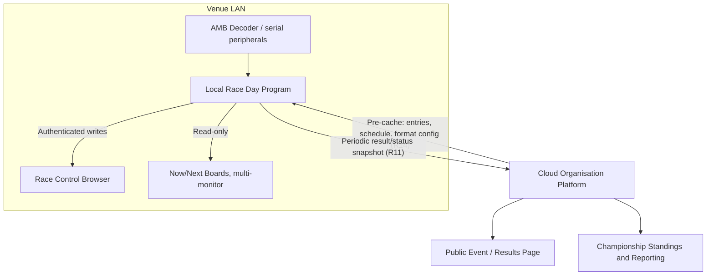
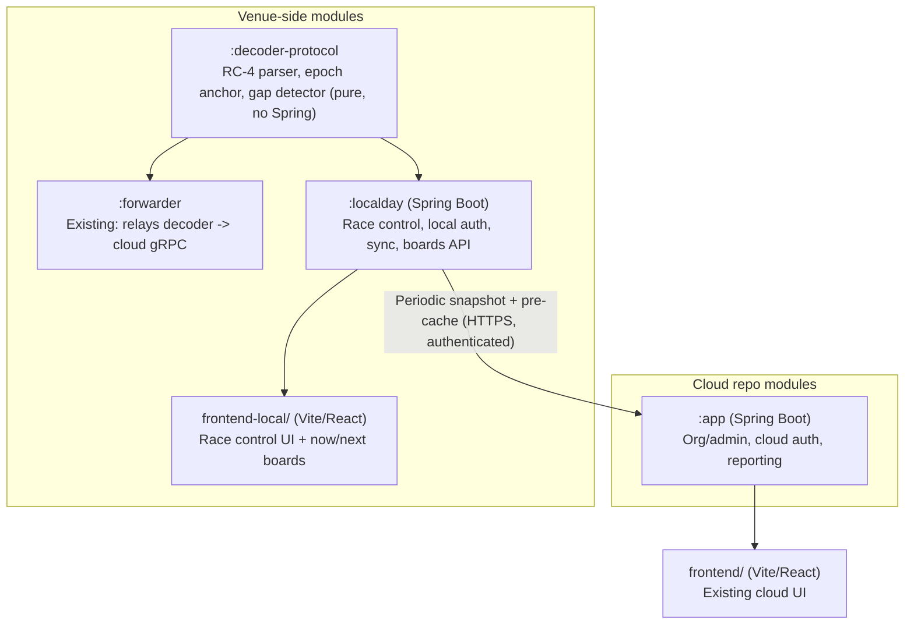

> **Superseded (2026-10-04).** This plan was replaced by the local-only timing plan in tracking issue #8. The offline race-day app it describes (`localday/` + `frontend-local/`) and its cloud sync were removed in #21. Kept for history only.

# Offline Race-Day Resilience Split Architecture - Plan

## Goal Capsule

- **Objective:** Replace the offline race-day resilience architecture with a clean split — the cloud stays exactly as it is today for organization and admin, while a new, independent local program becomes sole authority for running an event day (check-in, race control, timing, results, public boards), fully capable with zero internet.
- **Product authority:** This plan supersedes the hybrid architecture in `docs/plans/2026-08-04-001-feat-offline-race-day-resilience-plan.md` (its Key Decisions, Key Technical Decisions, and Implementation Units) as the offline / race-day-resilience decision going forward. That plan's target behavior — its Requirements, Key Flows, and Acceptance Examples — remains valid source material for what the system must do; only its architecture is replaced. Racer self-service, event/championship administration, and cross-club reporting remain cloud-owned and are not active scope here.
- **Open blockers:** None. Kiosk hardware topology defaults to single-station for the initial build (see Planning Contract Assumptions); remaining open items are non-blocking and tracked in Outstanding Questions.

---

## Product Contract

### Summary

Split the system into two independent products: the cloud keeps its current job (event/championship organization, registration, reporting) untouched, while a new, independent local web program — its own backend, its own frontend, no shared code with the cloud — becomes the sole authority for running an event day. It runs check-in, race control, live timing, results, and RCResults-style multi-monitor now/next boards with zero cloud dependency, and pushes periodic result snapshots up to the cloud whenever connected, rather than trying to keep two live systems reconciled in real time.

### Problem Frame

Internet at the venue has already gone down mid-meeting at real regional-championship and nationals events, taking lap recording with it — exactly the meetings that can least afford it, with high entry counts, tight schedules, and hundreds of people needing to see what heat is running. The current cloud-hosted modular monolith has no answer to this: the forwarder only relays raw decoder data over gRPC, race control runs entirely server-side, and live positions are in-memory-only by design, so a network drop doesn't just interrupt timing — it removes race control's ability to function at all.

A prior plan (2026-08-04) worked through this in detail and proposed a hybrid: extend the forwarder into an embedded Spring Boot process serving the cloud's own frontend, sharing a `racecontrol-core` module with the cloud, and continuously syncing over three separate gRPC channels. Planning and a full multi-persona review found that shape generated a large amount of net-new infrastructure — most of the multi-round race-control engine ported behind a repository abstraction, a second local relational schema designed to mirror the cloud's own model for hot-swap interchangeability, a full credential lifecycle (per-instance signing keys, a cloud-side trust registry, revocation), and a generation-number/quarantine scheme to guard against a reconnecting "zombie" device — whose entire purpose was keeping the cloud and venue app interchangeable, not running a race without losing data. This plan still needs its own local persistent store for entries, schedule, format config, and race state (R1, R6, R10, R14); what the split eliminates is specifically the interchangeability-oriented schema, not local persistence itself.

Separately, RCResults — the software this system replaces — already proves a simpler pattern works in the field: a fully local, resilient program that runs check-in, race control, timing, multi-monitor now/next boards, and serial peripherals with no live cloud dependency, uploading and broadcasting results as a secondary action. Its known weakness is manual data entry for event organization, which this system's cloud side (registration, admin, pre-entry) already solves independently. This plan adopts that split instead of the hybrid.

### Key Decisions

- **KD1. Split into two independent products rather than a hybrid sharing code or UI with the cloud.** (session-settled: user-directed — chosen over the prior plan's shared-core, shared-frontend hybrid: RCResults' own field-proven local-only operation validates the split, and the hybrid's shared module, dual auth, and generation-number machinery exist to keep two systems interchangeable, not to prevent data loss.)
- **KD2. The local program is an independent web application — its own Spring Boot backend and its own frontend — rather than a native desktop app or shared UI with the cloud.** (session-settled: user-directed — chosen over a genuine native GUI: hardware access (decoder, serial peripherals, barcode/QR/NFC readers) is backend-mediated either way, since a browser's Web NFC/Serial APIs aren't a reliable cross-platform story, so native buys nothing there; staying in the team's existing JVM/React skillset avoids a second permanent UI stack. An API-first design leaves a native client possible later without building it now.) Governs R6, R7.
- **KD3. Race-control logic is implemented independently in the local program rather than extracted into a module shared with the cloud.** (session-settled: user-directed — chosen over the prior plan's `racecontrol-core` extraction: avoids porting most of the multi-round race-control engine behind a repository abstraction, accepting a small drift risk between two independent implementations of the same rules as a materially cheaper trade. This trade is a redistribution of effort — R6 still requires reimplementing the full race-control workflow, currently 625+ lines of JPA-coupled logic across `RaceStateMachineService`, `RoundGeneratorService`, and `BumpUpSeedingService` — not a pure reduction; planning should size R6's build cost explicitly rather than treating "materially cheaper" as already proven.) Governs R6.
- **KD4. The cloud remains authoritative for event organization (entries, schedule, format config) and hands a snapshot to the local program at day-open; the local program is then sole authority for the day, and the cloud does not accept concurrent edits to an opened day.** (session-settled: user-directed — a static open/closed flag replaces the prior plan's live heartbeat-driven auto-lockout, since there's no longer a second system trying to stay simultaneously write-authoritative.) Governs R1, R2.
- **KD5. Sync from local to cloud is periodic result/status snapshots (laps, results, standings, current heat/next-up), not fine-grained mirroring of every race-control action.** (session-settled: user-directed — chosen over the prior plan's domain-event sync channel: a frequent snapshot gives the cloud a reasonably accurate live picture without replicating a full audit trail, and removes the need for a separate domain-event channel entirely.) Governs R11.
- **KD6. Local authentication uses a simple local session rather than a per-instance signing keypair with a cloud-side trust registry and revocation.** (session-settled: user-directed — chosen over the prior plan's credential lifecycle: with no live heartbeat and no concurrently-authoritative cloud to defend against, cryptographic revocation doesn't defend against anything a simpler mechanism can't. Officials get a session from pre-cached credentials at local login; device loss is a manual declaration, not a key-revocation event.) Governs R9, R16.
- **KD7. A device-loss declaration is a manual official action with no automatic detection, and the cloud must reject a superseded device's snapshot rather than let it silently overwrite a replacement device's newer data.** (session-settled: user-approved — proposed as a safeguard once periodic-snapshot sync plus no credential revocation was chosen: without an ordering guard, a "lost" device reconnecting later could clobber the replacement's data with stale results; the user agreed a lightweight guard is needed even without the full trust-registry machinery it replaces.) Governs R13.
- **KD8. The local program's public boards match RCResults' existing multi-monitor now/next capability (current heat, next-up, results) during a full outage, rather than either going dark or needing full live-timing-table parity for attendees.** (session-settled: user-directed) Governs R7.

### Actors

- **Race official** — opens and closes the event day, runs race control, performs check-in and transponder reassignment at the venue.
- **Attendee / spectator (venue)** — views the local now/next boards and results over the venue's local network, connectivity-independent. Read-only.
- **Racer** — pre-entered via the cloud portal ahead of the event; unaffected by venue connectivity during the meeting itself.
- **Cloud Organisation Platform** (system) — authoritative for event/championship setup, registration, profiles, and reporting; receives periodic snapshots during the day; authoritative again once a day fully closes and syncs.
- **Local Race Day Program** (system) — an independent local web application, sole authority for a single venue's event day once opened; not shared code or UI with the cloud.

### Requirements

**Authority & lifecycle**

- R1. An official can explicitly open an event day at the venue, which pulls or confirms the pre-cached entries, schedule, and format config, and hands sole local authority for that day to the Local Race Day Program.
- R2. Once a day is open, the cloud does not accept direct edits to that event's organization data until the official explicitly closes the day and sync is confirmed complete — a static lock set at open time, not a live-monitored one.
- R3. An official can explicitly close an event day once racing concludes; if not all local data has synced, the official is warned rather than told the close is complete, and the system keeps retrying the sync in the background.
- R4. Each event day is opened and closed independently; the Local Race Day Program is not required to preserve local authority continuously across multiple calendar days.

**Local program scope**

- R5. The Local Race Day Program supports check-in / attendance confirmation for pre-entered racers, independent of cloud connectivity, including barcode, QR, and NFC scanning where hardware supports it — keyboard-wedge and webcam-based scanning work directly in the browser UI; devices needing lower-level access are mediated by the local backend process running on the same machine. This applies directly to the single-station case; if the kiosk hardware topology (Outstanding Questions) resolves to multiple separate stations, NFC/serial scanning at those stations depends on the per-kiosk helper agent listed under Deferred for later, and is scoped accordingly.
- R6. The Local Race Day Program runs the full race-control workflow independently of the cloud — race state machine (start/stop/grid/marshal adjustments), multi-round grid progression (auto-seeding, bump-up promotion), live timing ingestion from the decoder, and live position/results display — as its own codebase, with no reduced feature set relative to the target behavior the prior plan established.
- R7. The Local Race Day Program serves current heat/race, next-up schedule, and results to attendees over the venue's local network via multi-monitor kiosk-style boards, matching RCResults' existing now/next board capability, independent of cloud connectivity. When no race is running (before the first heat, between rounds, or after the day's last race), the boards show the last completed heat's results plus the next scheduled heat, mirroring RCResults' reference idle-state behavior.
- R8. Officials can reassign a transponder to an existing entry locally during the event (e.g., for equipment failure), without needing cloud connectivity.
- R9. Race-control write actions (start/stop, grid calls, marshal adjustments, check-in, transponder reassignment) require an authenticated local official session, distinct from the anonymous read-only board/attendee view.

**Sync & data integrity**

- R10. The Local Race Day Program durably persists lap passings locally as they're captured, independent of cloud transmission, so a network interruption never loses captured lap data.
- R11. While connectivity exists, the Local Race Day Program periodically pushes result/status snapshots (laps, results, standings, current heat/next-up) to the cloud at a short interval, giving the cloud a reasonably accurate live picture without individually mirroring every race-control action. The cloud treats the local program's synced standings as provisional and always recomputes final standings itself from synced raw laps/results, so drift between the two independently-implemented scoring engines (KD3) cannot silently propagate into the cloud's authoritative record.
- R12. When connectivity resumes after an interruption, previously-unsent snapshots flow to the cloud automatically, with no manual export/import step from officials.
- R13. The cloud rejects a snapshot from a local program instance superseded by a device-loss declaration (R16), rather than letting it silently overwrite newer data from the replacement instance.
- R18. The sync/pre-cache channel between the Local Race Day Program and the cloud (R11, R12, R14) uses an authenticated, per-day-instance identity — distinct from officials' local session auth — over an encrypted transport, and this identity is the basis R13's supersession check operates on.

**Pre-event setup**

- R14. Before an event day is opened, the Local Race Day Program can pre-cache that day's entries, schedule, race format configuration, and the credentials officials need to log in locally, while still connected, so it can operate independently — including local login — even if connectivity is lost before the first race. The pre-cached local credential is a distinct, locally-scoped artifact (e.g. a per-official, per-event-day passcode or short-lived token) rather than a copy of the official's cloud login credential, and its practical validity ends with the event day rather than persisting indefinitely on the device. Pre-cached entry, schedule, and format-config data at rest on the venue machine is protected (e.g., disk- or app-level encryption) and is deleted or expired once the event day closes and sync is confirmed complete.

**Cloud & public visibility**

- R15. The public-facing cloud event/results page remains reachable during a venue outage, showing the most recently synced data along with an indication that live data may be delayed.

**Recovery**

- R16. An elevated official can manually declare a Local Race Day Program device lost from the cloud, unlocking that event day so a replacement instance can reopen it and resume race control for the remainder of the day. Declaring official confirms on-site that the original device is physically down, not merely unreachable from the cloud — since an unreachable-from-the-cloud device is indistinguishable from a normal connectivity outage (F2), where the original device is expected to keep running fine.
- R17. A device-loss declaration (R16) permanently flags that event-day as having a known, unrecoverable data gap. Unlike R15's transient outage indicator, this flag never auto-clears, and it propagates to that day's results, standings, and reports with a visible incomplete-data notice.

### Key Flows

- F1. **Open event day**
  - **Trigger:** Official starts setup at the venue before racing begins.
  - **Actors:** Race official, Cloud Organisation Platform, Local Race Day Program
  - **Steps:** Official logs in locally using pre-cached credentials → confirms or pulls cached entries/schedule/format config → local authority for the day begins; the cloud marks the day locked for direct edits. If an official's local login fails (mistyped credential, or an account missing from the pre-cache), a locally-cached secondary official/admin account can unlock or reset that official's local session without cloud connectivity.
  - **Covers:** R1, R2, R9, R14

- F2. **Run races through a mid-day outage**
  - **Trigger:** Connectivity is lost while a day is open.
  - **Actors:** Local Race Day Program, Race official, Attendees
  - **Steps:** The Local Race Day Program keeps running exactly as it does when connected — capturing laps, running race control, and serving local boards — with no cloud round-trip required at any point.
  - **Covers:** R6, R7, R10

- F3. **Reconnect and resync**
  - **Trigger:** Connectivity is restored.
  - **Actors:** Local Race Day Program, Cloud Organisation Platform
  - **Steps:** The Local Race Day Program resumes pushing unsent snapshots automatically → the cloud accepts them and the public page reflects the caught-up state.
  - **Covers:** R11, R12, R15

- F4. **Close event day**
  - **Trigger:** Official ends racing for the day.
  - **Actors:** Race official, Local Race Day Program, Cloud Organisation Platform
  - **Steps:** Official issues the close action → the system checks sync completeness → if complete, the cloud unlocks the day; if incomplete, the official is warned and background sync continues.
  - **Covers:** R3

- F5. **Device-loss recovery**
  - **Trigger:** A Local Race Day Program's machine fails or becomes unreachable while a day is open.
  - **Actors:** Race official (elevated), Cloud Organisation Platform, Local Race Day Program (replacement instance)
  - **Steps:** An elevated official manually declares the device lost from the cloud → the cloud unlocks the day and permanently flags the data gap → a replacement instance opens the same day via F1 → racing resumes. If the original device later reconnects, its snapshot is rejected as superseded rather than merged.
  - **Covers:** R13, R16, R17

### Diagrams

**Venue vs. cloud data flow:**



**Operational states across a race day:**

```mermaid
stateDiagram-v2
    [*] --> CloudAuthoritative
    CloudAuthoritative --> DayOpen: Official opens event day (R1); cloud locks edits (R2)
    DayOpen --> CloudAuthoritative: Official closes day, sync complete (R3)
    DayOpen --> DayClosed_PendingSync: Official closes day, sync still draining (R3)
    DayClosed_PendingSync --> CloudAuthoritative: Background sync completes later (R12)
```



`DayOpen` behaves identically whether or not the venue has connectivity — F2 is not a separate state, since the Local Race Day Program never depends on the cloud to keep running. F5's device-loss recovery is an out-of-band administrative override, not modeled above: an elevated official can force this from any `DayOpen` state without waiting on any automatic detection.

### Acceptance Examples

- AE1. **Covers R2, R6, R7.** Given the venue has no internet connectivity, When an official starts or stops a race, applies a marshal adjustment, or advances to the next round (including bump-up promotion), Then the local race-control UI behaves fully, and attendees see updated now/next boards and results on the venue's local network.
- AE2. **Covers R3.** Given an official closes the event day, When not all local snapshots have synced to the cloud yet, Then the official is warned that a final sync is pending, and the system keeps retrying it in the background.
- AE3. **Covers R15.** Given a venue is mid-outage, When a spectator visits the public cloud event page, Then they see the most recently synced results/schedule along with an indication that live data may be delayed.
- AE4. **Covers R9.** Given an unauthenticated device on the venue's local network, When it attempts a race-control write action, Then the Local Race Day Program rejects the request; only an authenticated official session can perform race-control actions.
- AE5. **Covers R13, R16, R17.** Given a Local Race Day Program's machine has failed mid-day, When an elevated official declares the device lost and a replacement instance reopens the day, Then racing resumes on the replacement, the day is permanently flagged with an incomplete-data notice, and if the original device later reconnects, its snapshot is rejected rather than overwriting the replacement's data.
- AE6. **Covers R11, R12.** Given lap/result snapshots were captured while disconnected, When connectivity resumes, Then those snapshots sync to the cloud automatically with no manual export or import step from officials.

### Success Criteria

- No captured lap data is lost due to a connectivity outage of any duration up to a full event day.
- Officials can run a complete event day — check-in, race control, multi-round grid progression, and results — with no cloud dependency at any point after the day is opened.
- Reconnection requires no manual export, import, or reconciliation step from officials.
- A device-loss recovery does not require waiting on any automatic detection, and never lets a superseded device's data silently overwrite a replacement's.
- The Local Race Day Program's public boards match RCResults' existing now/next capability during a full outage.

### Scope Boundaries

**Deferred for later:**

- Multi-day continuous local authority spanning more than one calendar day without a close/reopen cycle (R4).
- Creating brand-new walk-up entries while fully offline — transponder reassignment for *existing* entries (R8) is in scope, new entries are not.
- A native desktop client for the Local Race Day Program — the API-first local backend (KD2) leaves this open but it is not built now.
- Exact check-in kiosk hardware topology (a single station vs. several separate machines) — if multiple separate stations turn out to be needed, a thin per-kiosk helper agent bridging local hardware (barcode/NFC readers) to the browser UI is the expected fallback, not a full native rewrite.

**Outside this product's identity:**

- A shared race-control code module or shared frontend between the cloud and the Local Race Day Program (the prior plan's hybrid direction) — rejected: it exists to keep the two systems interchangeable, not to prevent data loss, and costs materially more than the local program's own independent implementation (KD1, KD3).
- A per-instance signing-key trust registry with cryptographic revocation (the prior plan's KD12/KTD4) — rejected: with no live heartbeat and no concurrently-authoritative cloud to defend against, it doesn't defend against anything a manual declaration plus a snapshot-ordering guard (R13) doesn't already cover (KD6, KD7).
- Fine-grained domain-event mirroring of every race-control action to the cloud — rejected in favor of periodic result/status snapshots (KD5, R11).

### Dependencies / Assumptions

- Assumes a venue machine is present and powered through the event day to run decoder ingestion — either the existing forwarder process (venues not yet using the Local Race Day Program) or the Local Race Day Program's own decoder client (venues that have adopted it, which do not run the forwarder concurrently — see Planning Contract KTD2).
- Assumes clubs generally have a mobile-hotspot or similar fallback, so complete multi-day blackouts are low-likelihood and out of scope for now (R4).
- Assumes RCResults' proven local-only operation is a valid reference baseline for what a resilient local race day must deliver — informs R6 (race-control parity) and R7 (now/next boards).
- Assumes the elevated role for R16's device-loss declaration is the existing `ADMIN` role — no new role is introduced.
- Assumes barcode/QR/webcam scanning work in any standard browser without special hardware access, and that NFC or serial devices needing lower-level access are attached to the same machine running the local backend, or bridged via a thin per-kiosk helper agent where they are not (R5).

### Outstanding Questions

**Resolved during planning** (see Planning Contract Key Technical Decisions): the check-in kiosk topology default, the snapshot sync interval, the superseded-snapshot rejection mechanism, and the cross-browser scanning approach are no longer open — see KTD5, KTD8, KTD4, and KTD6 respectively.

**Deferred (non-blocking) — do not hold up implementation-ready status:**

- If a Local Race Day Program's machine and the venue's connectivity fail at the same time, a replacement instance has no data source to recover from (no pre-cache on a fresh machine, no live cloud pull). Mitigation is operational (a club-provisioned spare pre-cached machine), not a build item — see Documentation / Operational Notes.
- A device-loss declaration is a manual, uncorroborated, race-day judgment call whose effect is permanent and irreversible. This plan implements it as specified (R16, R17); a correction path for a mistaken declaration is future hardening, not required for the initial build.
- The static day-open lock plus offline-only-for-existing-entries scope means there is no path to add or correct an entry for the whole day once it opens. This plan implements the requirements as specified; whether to add a narrow online-only correction path is a product-scope question for a future iteration, not this plan.
- Officials' authenticated race-control traffic and attendees' board traffic share the same venue LAN with no required encryption or segmentation between them. Out of this plan's build scope — venue network configuration is operational guidance, not application code; see Documentation / Operational Notes.
- The elevated device-loss role is assumed to be the existing `ADMIN` role, oriented toward configuration rather than floor operations. This plan keeps that assumption rather than introducing a new role (a product-scope change); the mitigation is operational — see Documentation / Operational Notes.

**From 2026-08-06 ce-plan review — recommend resolving before implementation of the affected units:**

- **(P0) No cross-check stops two legitimate `:localday` instances from both opening as sole authority while offline.** KTD4's fencing model assumes single-writer-per-day, but day-open (R14/F1) is designed to work fully offline with no cloud round-trip to check the R2 lock at that moment — so a club's own recommended spare pre-cached machine (Documentation / Operational Notes), opened while the original device is actually still fine, produces two independent authorities for the rest of the day with no incomplete-data flag on the loser. This threatens the plan's own top Success Criterion ("no captured lap data is lost"). Resolve before implementing U10/U13: either add a venue-local mutual-exclusion signal independent of the cloud lock (e.g. a LAN beacon or exclusive decoder-port bind a second instance checks before an offline day-open), or explicitly accept the risk with an operator-facing warning not to open a spare machine unless device-loss has been confirmed and declared.
- **U14 (cloud snapshot ingest, device-loss declaration, and public visibility) may still be too large after the U13/U14 split** — it bundles machine-auth fencing, human-auth device-loss/audit, and public-page display logic (a second frontend) in one unit. Decide before implementing Phase E whether to split it further (e.g. fencing+idempotency, device-loss+audit, and public-visibility as three units), with the public-visibility piece plausibly moving into U13's phase instead.

### Sources / Research

- `docs/plans/2026-08-04-001-feat-offline-race-day-resilience-plan.md` — the prior hybrid plan this work supersedes; its Requirements/Flows/Acceptance-Examples informed the target behavior preserved above, while its Key Decisions, Key Technical Decisions, and Implementation Units (shared `racecontrol-core`, dual gRPC channels, per-instance signing-key lifecycle) are the architecture this plan replaces.
- `forwarder/build.gradle.kts` / `settings.gradle.kts` — confirmed the forwarder currently has zero build dependency on `:app` and pulls in only Netty/gRPC/protobuf; the prior plan's hybrid architecture (shared module, shared Spring context) was entirely unbuilt, not partially in place.
- `app/src/main/java/dev/monkeypatch/rctiming/domain/race/RaceStateMachineService.java`, `RoundGeneratorService`, `BumpUpSeedingService` — confirmed the finishing-order/bump-up cascade is real, JPA-coupled complexity (438 and 187 lines respectively, six JPA repositories between them); this is the logic KD3 chooses to reimplement independently rather than extract into a shared, framework-independent module.
- `frontend/` — confirmed the existing React frontend already resolves its backend via a relative/env-configurable base URL (`VITE_API_BASE_URL`) with no hardcoded host, so a wholly separate local frontend (KD2) is architecturally unconstrained by the cloud frontend's existing setup.
- No Electron, Tauri, JavaFX, WinForms, or other native-desktop precedent exists anywhere in the current codebase — the only prior discussion of a native app is the 2026-08-04 plan's own rejection of a WinForms/C# alternative for the same reasons KD2 restates.
- User's direct operational knowledge of RCResults (local-only, resilient, multi-monitor now/next boards, serial device support, manual upload/broadcast, with manual data entry as its main pain point) — primary evidence motivating KD1, KD5, and KD8.

---

## Planning Contract

**Product Contract preservation:** largely unchanged. Planning added Requirement R18 and several requirement/flow clarifications during the 2026-08-06 `ce-doc-review` pass (recorded in that pass's edits). One further change during a later review round: the Dependencies/Assumptions line describing the forwarder was updated to reflect KTD2's decision (below) that the forwarder is not run alongside the Local Race Day Program at migrated venues — the original wording assumed the forwarder always keeps running, which KTD2 contradicts.

### Key Technical Decisions

- **KTD1. Local durable store is embedded/bundled PostgreSQL (e.g. Zonky `embedded-postgres`), not H2 or SQLite.** (session-settled: user-approved — chosen over H2 file-mode: H2's flat-file storage is prone to corruption on unclean shutdown, which is exactly the failure mode a venue laptop hits; chosen over SQLite: avoids a second ORM dialect and a second Flyway migration dialect alongside the cloud app's Postgres stack. Embedded Postgres gives the local program the *same* engine, dialect, and JSONB support as the cloud app with zero drift.) The local module owns its own separate Flyway migration history (its own `V1…` sequence, Postgres-dialect SQL) — it does not share the cloud app's `V1`–`V26` history or schema. Governs R1, R6, R10, R14.
- **KTD2. Decoder ingestion reuses the forwarder's existing RC-4 protocol-parsing and Netty client code via a new shared module, rather than reimplementing it.** (session-settled: user-approved — chosen over reimplementing from scratch: the forwarder's parser is a pure function with no Spring dependency and already has dedicated tests; reimplementing it would duplicate battle-tested epoch-anchoring and gap-detection logic for no benefit.) Extract the forwarder's protocol-parsing, epoch-anchoring, gap-detection, and Netty connection-management classes (including the reconnect/backoff layer, not only the frame parser — see U1) into a new `:decoder-protocol` Gradle module with no Spring dependency; both `forwarder` and the new local backend module depend on it. This does not touch KD1/KD3 (no shared code with `:app`) since neither the forwarder nor `:decoder-protocol` is part of the cloud app. **At a venue running the Local Race Day Program, `:forwarder` is not run alongside it** — `:localday` is the sole decoder client for that event day (per KD1's "sole authority" framing), which avoids two independent Netty clients contending for the same physical decoder connection on port 5100 (the RC-4 text protocol's simultaneous-connection limit is unconfirmed per `docs/AMB_DECODER_PROTOCOL.md`). `:forwarder` remains in place for venues not yet using the Local Race Day Program. Governs R6.
- **KTD3. The Local Race Day Program lives as new Gradle modules in this same monorepo, not a separate repository.** (session-settled: user-approved — chosen over a standalone repository: mirrors the existing `forwarder` module's precedent as a build-isolated sibling module in the same repo, keeping one CI pipeline, one versioning scheme, and one place to find the code.) New modules: `:localday` (Spring Boot 3.4.7 backend) and `frontend-local/` (a second, independent Vite/React app alongside the existing `frontend/`). `settings.gradle.kts` adds `:decoder-protocol` and `:localday` alongside the existing `:app` and `:forwarder`. Governs R6, R7; instantiates KD2.
- **KTD4. Superseded-snapshot rejection uses a monotonic per-instance generation counter (fencing-token pattern), not timestamp-based ordering.** (session-settled: user-approved — chosen over timestamp ordering: venue-laptop clocks are unmanaged and can drift or be manually misset, which silently breaks last-writer-wins; chosen over vector clocks/CRDT merge: the model is single-writer-per-day, not concurrent multi-writer, so full conflict-resolution machinery is unjustified complexity.) Each local instance has a stable instance ID; each day-open increments a generation number that stays fixed for the rest of that session and is carried on every synced snapshot (`instanceId`, `generation`, `snapshotId`, payload). The cloud tracks the highest generation seen per event day and **accepts a snapshot whose generation is equal to or higher than** the stored value (updating the stored value only when strictly higher), **rejecting only a snapshot whose generation is strictly lower** — the comparison polices cross-generation supersession, not per-request ordering within one generation, since a session's ordinary periodic pushes all carry the same generation. The generation check and the stored-value update happen as one atomic operation (a single conditional `UPDATE ... WHERE generation < :incoming`, or equivalent row-level locking) so two snapshots racing for the same event day can't lost-update the stored maximum. A `snapshotId`-based idempotency check (a uniqueness constraint on `(eventDayId, snapshotId)`; a repeat `snapshotId` returns the original outcome without reprocessing) is the separate mechanism that stops a retried upload after a flaky connection from double-applying — generation and `snapshotId` solve two different problems and neither substitutes for the other. Resolves the Product Contract's Outstanding Question on R13's mechanism. Governs R13, R18.
- **KTD9. The sync channel's machine-to-machine identity is minted and delivered alongside KTD5's officials' credential, not as a separately-designed mechanism.** (Closes a gap a deepening review found: R18/KTD4 require an identity distinct from officials' local session auth, but no unit owned minting, storing, or revoking it.) At pre-cache time (U10), the cloud mints both a day-scoped officials' credential (KTD5) and a day-scoped instance secret bound to that day-open's `instanceId`, over the same authenticated pre-cache channel; `SnapshotIngestController` (U14) authenticates the caller as that specific instance before the generation check runs. A device-loss declaration (R16) explicitly invalidates the original instance's secret, closing the window where a "lost" device's sync credential would otherwise stay valid indefinitely with only the generation counter as a backstop. This is a narrower mechanism than the Scope Boundaries' rejected "per-instance signing-key trust registry with cryptographic revocation" — that registry was rejected for defending against a *reconnecting stale device*, a job R13's generation guard already does; a single boolean invalidation triggered only by an explicit R16 declaration adds no registry, no key lifecycle, and no revocation-checking on every request, so it doesn't reintroduce the complexity Scope Boundaries rejected. The snapshot payload shape is defined as a versioned JSON Schema checked into both `:localday`'s and `:app`'s test resources — giving this newer channel the same contract rigor the existing `:forwarder`→`:app` gRPC/protobuf channel already has, without sharing code (KD1/KD3). Governs R18; extends KTD4, KTD5.
- **KTD5. The local login credential is a day-scoped, locally-scoped artifact minted before the event, not a copy of the cloud credential and not a short-TTL token.** (session-settled: user-approved — chosen over reusing the cloud JWT: a copy of the cloud credential would let a lost venue machine compromise the official's actual cloud account, which KD6's no-revocation stance can't contain; chosen over a short-TTL token: with no live revocation channel, a short expiry would strand offline officials mid-event.) Validity window covers the full event day (issued-at plus a window generous enough for early setup through late teardown, e.g. ~18 hours) rather than a JWT-style minutes/hours TTL, checked against elapsed local time since issuance rather than venue-laptop wall-clock time (U6) — the same clock-drift risk KTD4 raises for venue laptops applies equally here, so expiry does not trust wall-clock deltas. Stored client-side in IndexedDB, not `localStorage`. This is a distinct trust model from the cloud's stateless JWT + refresh-cookie flow (see `app/…/security/JwtAuthenticationFilter` for the pattern being explicitly diverged from, not followed) — device-loss declaration (KD7) is the correction mechanism in place of revocation. Governs R14; instantiates KD6.
- **KTD6. Check-in scanning uses a JS-based, `BarcodeDetector`-shaped decoding library (WASM-backed, e.g. a ZXing-WASM ponyfill) as the baseline for every browser, not the native `BarcodeDetector` Web API with per-browser patches.** (session-settled: user-approved — chosen over relying on the native API: it is Chromium-only, with no signal of Firefox/Safari adoption; coding to the same API shape with a polyfill gives one code path everywhere instead of two branches.) The library's WASM asset is bundled and self-hosted in `frontend-local/`, never fetched from a CDN at runtime — the whole premise is offline operation, and a CDN-hosted asset silently fails without connectivity. NFC scanning remains an optional Android/Chromium-only enhancement (Web NFC has no iOS Safari support), never a required path. Governs R5.
- **KTD7. The local decoder listener runs as a Spring `SmartLifecycle` bean, not an `ApplicationRunner`.** (Confirms and sharpens root `CLAUDE.md`'s stated convention with current Spring Boot 3.4.x behavior: `ApplicationRunner` has no stop hook and cannot participate in graceful-shutdown ordering, so `SmartLifecycle` is the only of the two options that can cleanly own a long-running Netty listener's lifecycle.) Use the async `stop(Runnable callback)` overload so the Netty event-loop group shuts down gracefully; size `spring.lifecycle.timeout-per-shutdown-phase` to comfortably exceed channel-drain time. Note the structural constraint (not a defect to work around): Spring Boot's own Tomcat graceful-shutdown bean has a hard-coded phase of `Integer.MAX_VALUE` and always stops first, so the decoder listener cannot be made to stop *before* Tomcat by phase alone — acceptable here since the two are functionally independent. Governs R6.
- **KTD8. Snapshot push interval defaults to 20 seconds while connected, plus an immediate push on every race-state transition and check-in event.** Gives R11's "reasonably accurate live picture" target a concrete default without flooding the sync channel; exposed as a config value so a club with slower connectivity can tune it. Each push carries results, standings, and current heat/next-up state in full (small, bounded by entry-list size), but laps are incremental — only laps captured since the last acknowledged `snapshotId` — so payload size stays bounded by activity-since-last-push rather than growing across the day; a lap omitted by a rejected or skipped push is included in the next successful one, since durable local persistence (R10) means nothing is lost, only delayed. Resolves the Product Contract's Outstanding Question on R11's interval. Governs R11.

### High-Level Technical Design

**Module and dependency layout:**



`:localday` has no dependency on `:app` (KD1/KD3); its only shared code is `:decoder-protocol`, which is not part of the cloud app either (KTD2).

**Snapshot sync and superseded-device rejection (KTD4):**

```mermaid
sequenceDiagram
    participant L as Local Race Day Program
    participant C as Cloud Organisation Platform
    L->>L: Increment generation counter at day-open (fixed for the session)
    loop Every 20s or on state transition
        L->>C: POST snapshot {instanceId, generation, snapshotId, payload}
        alt generation < cloud's stored max for this day
            C-->>L: 409 Superseded (rejected, not merged)
        else generation >= stored max (atomic compare-and-update)
            C->>C: Persist snapshot; update stored max if strictly higher
            alt snapshotId already recorded for this day
                C-->>L: 200 Accepted (idempotent replay, not reprocessed)
            else
                C-->>L: 200 Accepted
            end
        end
    end
```

A device-loss declaration (R16) does not change this flow directly — it unlocks the day for a *replacement* instance, which opens at a higher generation than the original ever reached, so the original's later reconnect attempts are rejected by the same comparison with no special-case logic. It additionally invalidates the original instance's sync credential (KTD9), so a rejected reconnect can't retry indefinitely against a still-valid credential.

### Assumptions

- Embedded-postgres binary distributions cover the actual venue-laptop OS/architecture matrix (Windows/macOS/Linux, x86_64/arm64) clubs use; verify during U2 before committing.
- `spring.lifecycle.timeout-per-shutdown-phase` is tuned generously enough to cover Netty channel-drain time without truncating shutdown; exact value is an implementation-time tuning task, not a planning-time constant.
- Kiosk hardware topology defaults to single-station for this build (per R5); multi-station support remains Deferred for later per Scope Boundaries, so U7 does not build the per-kiosk helper agent.
- The barcode-decoding WASM asset's build/bundling step is compatible with the `frontend-local/` Vite build pipeline; verify during U7.
- R14's at-rest protection for pre-cached data relies on the venue machine's OS-level full-disk encryption (BitLocker/FileVault/LUKS), not application-layer column encryption — embedded Postgres has no native at-rest encryption of its own, and encrypting individual JPA/JSONB columns would add material complexity for a single-venue-day threat model. This is stated explicitly rather than left implicit; see Documentation / Operational Notes.

### Sources / Research

- Repo research (2026-08-06) corrected two established facts before planning: `RoundGeneratorService`/`BumpUpSeedingService` live in `dev.monkeypatch.rctiming.service`, not `domain.race` (only `RaceStateMachineService` is in `domain.race`); and the "six JPA repositories" figure applies to `RoundGeneratorService` alone (`RaceStateMachineService` uses 2 directly plus service-level coupling to `RoundGeneratorService`, `ResultSnapshotService`, `LapTimingService`, `LiveTimingHub`; `BumpUpSeedingService` uses 2).
- Repo research confirmed `forwarder/build.gradle.kts` has zero dependency on `:app` and that `forwarder/src/main/java/.../forwarder/timing/` already contains a working, Spring-free `Rc4TextParser` (pure function), `Rc4InboundHandler`, `EpochAnchor`, and `SeqGapDetector` with dedicated tests (`Rc4TextParserTest`, `EpochAnchorTest`, `GapDetectionTest`) — the concrete basis for KTD2.
- Repo research confirmed the cloud app's "domain vs. query module" CQRS-lite split (`docs/architecture.md`) is a package convention inside `:app`, not a physical Gradle module boundary — `:forwarder`'s standalone-module pattern, not `:app`'s package convention, is the closer precedent for KTD3.
- Repo research confirmed Flyway migrations at `app/src/main/resources/db/migration` use plain JPA entities (no exotic mapping beyond `@JdbcTypeCode(SqlTypes.JSON)` for JSONB) — the pattern KTD1's local entities should mirror.
- Best-practices research (2026) found H2 file-mode has a well-documented corruption risk on unclean shutdown (cited: Atlassian/Keycloak issue trackers) and that SQLite's Hibernate dialect lives in `hibernate-community-dialects`, uncovered by Hibernate's own CI — both directly motivate KTD1.
- Best-practices research confirmed the `BarcodeDetector` Web API is Chromium-only in 2026 with no adoption signal elsewhere, and identified the `barcode-detector` ponyfill (wrapping `zxing-wasm`) as the current best-practice fallback pattern, plus the CDN-default-fetch pitfall for its WASM asset — the basis for KTD6.
- Best-practices research confirmed Web NFC is Chromium/Android-only (~6% global browser support, no iOS Safari) — informs KTD6's NFC-as-enhancement-only stance.
- Best-practices research identified the generation-counter/fencing-token pattern (used to stop zombie/stale distributed-lock writers) as the right-sized mechanism for KTD4, explicitly ruling out both timestamp LWW (clock-drift risk) and vector clocks/CRDTs (solves a concurrent-writer problem this system doesn't have).
- Framework-docs research confirmed Spring Boot 3.4.x's `SmartLifecycle` vs. `ApplicationRunner` tradeoffs and the `Integer.MAX_VALUE`-phase constraint on Tomcat's own graceful-shutdown bean (Spring Boot GitHub issue #31714) — the basis for KTD7.
- Framework-docs research flagged CVE-2025-41254 (Spring Framework STOMP CSRF/authorization-bypass, fixed in Spring Framework 6.2.12) as directly relevant to this system's STOMP live-timing topics — confirm the Spring Boot 3.4.x patch version pinned for `:localday` (and `:app`) resolves to Spring Framework ≥6.2.12 before shipping (see U5's verification).
- A deepening architecture review confirmed `forwarder/src/main/java/.../forwarder/timing/ParsedPassing.java`, `EpochCorrectedPassing.java`, `AmbRc4TimingSource.java`, and `TimingSource.java` are Spring/gRPC-free like the four classes originally named for KTD2's extraction, and that `ForwarderApplication.java` wires the decoder source to the gRPC client only via a constructor callback at the composition root — confirming the extraction boundary is real but was originally scoped too narrowly (fixed in U1).
- A deepening architecture review flagged that `:forwarder` and `:localday` running concurrently at the same venue would both open independent TCP connections to the same physical AMB decoder, and that `docs/AMB_DECODER_PROTOCOL.md` does not confirm the RC-4 text protocol (port 5100) tolerates multiple simultaneous clients — resolved by KTD2's "forwarder not run alongside localday" clarification rather than left as an open risk.
- A deepening security review, cross-checked against `app/src/main/java/dev/monkeypatch/rctiming/security/` (`SecurityConfig`, `JwtAuthenticationFilter`) and the existing `EntryAuditLog`/`EntryService.writeAudit` precedent, found the sync channel's machine identity was named (R18) but not assigned to any unit, and that `DeviceLossController` had no audit-trail requirement despite the codebase's own precedent for auditing comparably irreversible actions — both addressed in KTD9 and U14 respectively.
- A deepening data-integrity review found the originally-stated generation comparison (`generation > stored max`, checked on every push) would reject every snapshot after the first one in a session, since generation is fixed for the session per KTD4's own design — corrected in KTD4 and the sequence diagram above; the same review identified the missing atomicity requirement on the compare-and-update and the unspecified `snapshotId` conflict behavior, both folded into KTD4's text.

### System-Wide Impact

- **Three distinct auth mechanisms now coexist**, each scoped to a different actor/trust type rather than an accidental proliferation: the cloud's existing stateless JWT + refresh-cookie flow (officials/racers on `:app`), the new day-scoped local session (KTD5, officials on `:localday`), and the new per-day-instance sync secret (KTD9, machine-to-machine between `:localday` and `:app`). None of the three should be merged with another — a machine credential with generation-counter semantics does not fit `JwtAuthenticationFilter`'s per-user refresh-cookie model, and a human officials' credential should not double as the sync channel's identity.
- **`:forwarder`'s role changes at venues adopting the Local Race Day Program.** It is not run alongside `:localday` (KTD2) — venues using the split architecture retire the forwarder's gRPC-to-cloud relay in favor of `:localday`'s own decoder ingestion and periodic snapshot sync. Venues not yet migrated keep running `:forwarder` unchanged.
- **A new client-side XSS surface exists in `frontend-local/`**: an ~18-hour, full-write-privilege local credential in IndexedDB, plus a bundled third-party WASM barcode-decoding library and live camera access, all on one origin. `LocalSecurityConfig`'s CSP header (U6) is the mitigation; there is no server-side revocation to fall back on if it's bypassed (KD6).
- **A new cross-cutting data lifecycle**: racer PII (entries/schedule) is durably cached on venue hardware outside the cloud's normal perimeter, then purged at day-close (U10). At-rest protection for that window relies on OS-level full-disk encryption (Planning Contract Assumptions), not the application.
- **A new machine-to-machine trust boundary** (`:localday` → `:app` sync channel, KTD9) is the first of its kind in this codebase alongside the existing `:forwarder` → `:app` gRPC/protobuf channel — the two are architecturally parallel (each a venue-side process authenticating to the cloud) but use different transport and schema mechanisms; U14's versioned JSON Schema is this channel's equivalent of the gRPC channel's protobuf contract.

### Risks & Dependencies

- **Embedded-postgres OS/arch coverage** (Zonky binaries) is a real external dependency on a project this repo doesn't control; verify the actual venue-laptop OS/arch matrix before committing (Assumptions), with H2 file-mode as a documented fallback discussion only if coverage is confirmed insufficient — not a default to fall back to silently.
- **Spring Framework CVE-2025-41254** (STOMP CSRF/authorization bypass, fixed in 6.2.12) must be confirmed patched in whatever Spring Boot 3.4.x version `:localday` and `:app` pin, before either ships a STOMP endpoint (Definition of Done).
- **The RC-4 text protocol's simultaneous-connection limit is unconfirmed** (`docs/AMB_DECODER_PROTOCOL.md` only documents a 4-connection limit for the P3 binary protocol). KTD2's "forwarder not run alongside localday" decision sidesteps this rather than resolving it outright; if a venue ever needs both processes running concurrently against the same decoder, this becomes a blocking question, not just a risk.
- **The barcode-decoding WASM library's bundling and CSP compatibility** with the `frontend-local/` Vite pipeline is unverified until U7/U6 land; a library that assumes CDN delivery or `unsafe-eval` at runtime would conflict with both KTD6 (self-hosted asset) and U6's CSP requirement.
- **The `ADMIN` role, used elsewhere in this codebase for routine club-configuration actions, is also the sole trigger for an irreversible, day-affecting device-loss declaration** (R16/R17). This plan mitigates with a mandatory audit record (U14) rather than introducing a new role or step-up re-authentication — an explicit, deliberate scope boundary, not an oversight; revisit if device-loss declarations turn out to be frequent enough in practice to warrant a lighter-weight, more auditable trigger.

---

## Implementation Units

**Phase A — Foundation**

### U1. Extract shared decoder-protocol module

**Goal:** Pull the forwarder's existing RC-4 protocol-parsing and Netty-handling code into a new, dependency-free shared module so both the forwarder and the new local backend can use it without duplication.

**Requirements:** R6. Instantiates KTD2.

**Dependencies:** None (first unit).

**Files:**
- Create `decoder-protocol/build.gradle.kts` (new Gradle module: plain Java, Netty + no Spring/gRPC dependency for the pure-parsing classes; Netty stays since the inbound handler and connection-management classes need it).
- Move `forwarder/src/main/java/.../forwarder/timing/Rc4TextParser.java`, `EpochAnchor.java`, `SeqGapDetector.java`, `Rc4InboundHandler.java`, `ParsedPassing.java`, `EpochCorrectedPassing.java`, `AmbRc4TimingSource.java`, and `TimingSource.java` into `decoder-protocol/src/main/java/dev/monkeypatch/rctiming/decoderprotocol/timing/...` — repackaged from `dev.monkeypatch.rctiming.forwarder.timing` to `dev.monkeypatch.rctiming.decoderprotocol.timing` so the shared code isn't still branded under the `forwarder` package it no longer belongs to. This moves the full connection-management layer (parsing, epoch anchoring, gap detection, and the Netty bootstrap/reconnect-backoff wiring), not the parser alone — leaving the connection-lifecycle code behind in `forwarder` would force `:localday` to reimplement exponential backoff and channel wiring independently, the exact duplication KTD2 exists to avoid.
- Move the matching test files (`Rc4TextParserTest`, `EpochAnchorTest`, `GapDetectionTest`, `AmbRc4TimingSourceIT`, `ReconnectBehaviourTest`, `TimingSourceTest`) into `decoder-protocol/src/test/java/...`, updated for the new package.
- Modify `forwarder/build.gradle.kts` to add `implementation(project(":decoder-protocol"))` and remove the moved sources/tests.
- Modify `settings.gradle.kts` to add `include(":decoder-protocol")`.

**Approach:**
- Keep the parser as a pure function (`byte[]`/line → `ParsedPassing`), per root `CLAUDE.md`'s existing rule — do not introduce Spring or gRPC dependencies into this module.
- `Rc4InboundHandler` and `AmbRc4TimingSource` keep their Netty dependency; `decoder-protocol` depends on Netty only, nothing else.
- The forwarder's own gRPC-relay code (`ForwarderGrpcClient` and callers), `SimulatorMain`, and other forwarder-specific classes stay in `forwarder/` — only the protocol-parsing and connection-management classes move.

**Test scenarios:**
- Existing `Rc4TextParserTest`, `EpochAnchorTest`, `GapDetectionTest`, `TimingSourceTest`, `ReconnectBehaviourTest` pass unchanged after the move and repackage (proves the extraction didn't change behavior).
- `forwarder`'s own build and existing integration test (`AmbRc4TimingSourceIT`) still pass after repointing to the new module dependency via its constructor-callback composition (per `ForwarderApplication`'s existing wiring pattern).

**Verification:** `./gradlew :decoder-protocol:test :forwarder:test` passes; `./gradlew :forwarder:build` succeeds with the new module dependency.

### U2. Scaffold `:localday` Spring Boot module with embedded PostgreSQL

**Goal:** Stand up the new local backend module with its own embedded PostgreSQL instance, its own Flyway migration history, and JPA entities for cached entries/schedule/format-config and durable lap storage.

**Requirements:** R1, R10, R14. Instantiates KTD1.

**Dependencies:** U1 (module exists in `settings.gradle.kts` before this adds another).

**Files:**
- Create `localday/build.gradle.kts` (Spring Boot 3.4.7, Spring Data JPA, Flyway + `flyway-database-postgresql`, `io.zonky.test:embedded-postgres`, the platform-matched `io.zonky.test.postgres:embedded-postgres-binaries-<platform>` artifact(s) for every OS/arch the club fleet uses (vendored as an explicit build dependency, not resolved over the network at first launch — required for the "fully capable with zero internet" claim to hold on a genuinely fresh install), `project(":decoder-protocol")`).
- Add `include(":localday")` to `settings.gradle.kts`.
- Create `localday/src/main/resources/application.yml` (embedded-postgres data directory path, `spring.lifecycle.timeout-per-shutdown-phase`).
- Create `localday/src/main/resources/db/migration/V1__initial_schema.sql` (own migration history — cached entry/schedule/format-config tables, lap-passing table; do not reuse `app/`'s `V1`–`V26`).
- Create JPA entities under `localday/src/main/java/.../localday/domain/` for cached entries, schedule, format config snapshot, and lap passings.

**Approach:**
- Mirror `app/`'s plain-JPA entity style (`@Entity`, `@Id @GeneratedValue(IDENTITY)`, `@JdbcTypeCode(SqlTypes.JSON)` for the format-config JSONB column) rather than introducing a different persistence style.
- Start embedded Postgres via a `SmartLifecycle` bean (or Spring Boot's own startup hook) that provisions a real on-disk data directory (never tmpfs/in-memory) and registers a clean-shutdown hook, per KTD1's durability rationale.
- `V1__initial_schema.sql` (and every later `:localday` migration) consists entirely of transactionally-safe DDL (no `CREATE INDEX CONCURRENTLY`, no non-transactional `ALTER TYPE ... ADD VALUE`), so a crash mid-migration always rolls back cleanly under Flyway's per-migration transaction wrapping — a venue laptop has no on-site DBA to run `flyway repair` if `schema_history` were ever left in a `failed` state.
- At-rest protection for the cached PII in this database relies on the venue machine's OS-level full-disk encryption, not application-layer column encryption (see Planning Contract Assumptions and Documentation / Operational Notes) — this unit does not add column-level encryption.
- Verify the embedded-postgres binary distribution covers the target OS/arch matrix before finalizing (per Assumptions).

**Test scenarios:**
- Happy path: application starts, embedded Postgres initializes at the configured data directory, Flyway applies `V1` successfully.
- Edge case: application restarts against an existing data directory (simulating a laptop reboot) — data persists across restart.
- Failure path: killing the embedded-postgres process (`pg_ctl stop -m immediate` against the local data directory, or an OS-level kill) during steady-state writes, followed by restart — verify no corruption and a clean recovery, proving the durability rationale behind choosing embedded Postgres over H2.
- Failure path: killing the process specifically while `V1` is being applied (a distinct window from steady-state writes) — verify Flyway rolls back cleanly and re-applies successfully on the next start, with no manual `flyway repair` needed.
- Integration: saving a cached entry via the JPA repository round-trips correctly, including the JSONB format-config column.
- Integration: `:localday` starts successfully with network access disabled on a machine that has never run it before, proving the vendored embedded-postgres binaries (not a runtime download) back the "zero internet" claim.

**Verification:** `./gradlew :localday:test` passes for the steady-state and mid-migration kill scenarios where automatable; a manual restart-after-kill check remains a pre-release verification note for any behavior that genuinely requires OS-level process-kill semantics not reproducible in CI.

**Phase B — Race Control Core (independent reimplementation)**

### U3. Local race state machine and marshal adjustments

**Goal:** Reimplement the race lifecycle state machine (`PENDING → GRID → RUNNING → STOPPED/FINISHED`) and marshal lap adjustments independently in `:localday`, matching the cloud's target behavior per R6 without sharing code with `:app` (KD3).

**Requirements:** R6, R9 (write actions require an authenticated session — see U6). Covers AE1.

**Dependencies:** U2.

**Files:**
- Create `localday/src/main/java/.../localday/race/RaceStateMachineService.java` and `RaceState.java` enum.
- Create `localday/src/main/java/.../localday/race/MarshalAdjustment.java` (entity + audit trail).
- Create matching test files under `localday/src/test/java/.../race/`.

**Approach:**
- Reference `app/src/main/java/dev/monkeypatch/rctiming/domain/race/RaceStateMachineService.java` as the target-behavior reference (not a code-sharing dependency, per KD3) — reimplement the same transition rules and `IllegalStateTransitionException`-on-invalid-transition behavior independently.
- Marshal adjustments remain non-state-transition records (+1/−1 with audit trail), same semantics as the cloud version's documented behavior.

**Test scenarios:**
- Happy path: each valid transition (`PENDING→GRID→RUNNING→STOPPED→RUNNING`, `RUNNING→FINISHED`) succeeds and is observable.
- Error path: each invalid transition attempt is rejected (mirrors the cloud's 409 behavior, adapted to `:localday`'s own error handling).
- Edge case: a marshal adjustment record is created (+1/−1 with audit trail) without altering race state — position recalculation and broadcast are proven at U5, which depends on this unit.

**Verification:** `./gradlew :localday:test` passes using only this unit's own dependencies (U2) — the position-recalculation and STOMP-broadcast integration scenarios that build on this state machine are owned by U5, not this unit, since they require infrastructure U5 introduces.

### U4. Local multi-round grid progression (auto-seeding, bump-up promotion)

**Goal:** Reimplement multi-round grid progression — auto-seeding and bump-up promotion — independently in `:localday`, matching `RoundGeneratorService`/`BumpUpSeedingService`'s target behavior.

**Requirements:** R6. Covers AE1.

**Dependencies:** U3.

**Files:**
- Create `localday/src/main/java/.../localday/race/RoundGeneratorService.java`, `BumpUpSeedingService.java`.
- Create matching test files.

**Approach:**
- Reference `app/src/main/java/dev/monkeypatch/rctiming/service/RoundGeneratorService.java` and `BumpUpSeedingService.java` as target-behavior references (reimplement, do not import — KD3).
- Note the existing gap: the cloud's own `BumpUpSeedingService` has no dedicated test file today (repo research finding) — do not assume the reference implementation's edge-case behavior is fully proven; derive bump-up test scenarios from the Product Contract's stated behavior (auto-seeding, bump-up promotion) rather than from an untested reference.

**Test scenarios:**
- Happy path: auto-seeding produces the expected round/heat structure for a straightforward entry list.
- Edge case: bump-up promotion with a tied qualifying position.
- Edge case: bump-up promotion when the number of qualifiers doesn't evenly divide into the next round's grid size.
- Integration: round advancement triggers a state transition (ties to U3) and a local board update (ties to U9).

**Verification:** `./gradlew :localday:test` passes; scenarios above independently verify behavior the cloud's own untested `BumpUpSeedingService` counterpart does not currently prove — this unit should end up with better test coverage than its cloud counterpart, not just parity.

### U5. Local decoder ingestion and live timing

**Goal:** Embed the shared decoder-protocol's Netty TCP client as a background `SmartLifecycle` bean, compute in-memory live positions/results, and broadcast over local STOMP.

**Requirements:** R6, R10. Covers AE1, F2.

**Dependencies:** U1, U3.

**Files:**
- Create `localday/src/main/java/.../localday/timing/DecoderListenerLifecycle.java` (implements `SmartLifecycle`, wraps `:decoder-protocol`'s `Rc4InboundHandler`).
- Create `localday/src/main/java/.../localday/timing/LapTimingService.java`, `LiveTimingHub.java`, `LiveRaceState.java` (mirroring the cloud's in-memory-only live-position pattern from `dev.monkeypatch.rctiming.timing`, per root `CLAUDE.md`'s "do not persist live positions" rule — but persisting durable lap passings per R10).
- Configure Spring WebSocket/STOMP in `localday/src/main/java/.../localday/config/WebSocketConfig.java`.

**Approach:**
- `DecoderListenerLifecycle` runs on a dedicated background thread, isolated from the Tomcat thread pool, per KTD7 — implement `SmartLifecycle` with the async `stop(Runnable callback)` overload, not `ApplicationRunner`.
- Durably persist each lap passing to the `:localday` database as it's captured (R10), independent of any downstream broadcast or sync failure.
- Confirm the pinned Spring Boot 3.4.x patch version resolves to Spring Framework ≥6.2.12 (CVE-2025-41254 fix) before configuring the STOMP endpoint, per Sources/Research.

**Test scenarios:**
- Happy path: a simulated RC-4 passing record flows from the Netty handler through to a persisted lap-passing row and a STOMP broadcast.
- Edge case: a gap in the sequence number (`SeqGapDetector`) is logged/handled without crashing ingestion.
- Failure path: the decoder connection drops mid-race — ingestion resumes cleanly on reconnect with no lost already-received laps.
- Integration: a race-state transition from U3 triggers a STOMP broadcast to subscribed clients.
- Integration: a marshal adjustment from U3 triggers position recalculation and a corresponding STOMP broadcast, without altering race state.
- Integration: `DecoderListenerLifecycle.stop()` completes gracefully during application shutdown without blocking Tomcat's own shutdown (per KTD7's phase-ordering note).

**Verification:** `./gradlew :localday:test` passes; manual verification with the existing `forwarder/…/simulator` fake-decoder tooling (`FakeDecoderServer`) confirms end-to-end ingestion against a live-like feed.

**Phase C — Local Web App (auth, check-in, race control UI, boards)**

### U6. Local authentication

**Goal:** Implement the day-scoped local credential mint-and-validate flow (KTD5), distinct from the cloud's JWT session model, gating race-control write actions per R9.

**Requirements:** R9, R14, R16 (elevated-role check for device-loss declaration, cloud-side — see U12). Covers AE4.

**Dependencies:** U2.

**Files:**
- Create `localday/src/main/java/.../localday/auth/LocalSessionService.java`, `LocalCredential.java` entity.
- Create `localday/src/main/java/.../localday/config/LocalSecurityConfig.java` (gates write endpoints; anonymous read-only for board/attendee endpoints; a restrictive Content-Security-Policy header for `frontend-local/` — `script-src 'self'`, no `unsafe-inline`/`unsafe-eval`, `connect-src` scoped to same-origin plus the cloud sync origin — since KTD5's credential and KTD6's bundled WASM decoding library both live in this origin).
- Create `frontend-local/src/lib/auth.ts` (IndexedDB-backed credential storage, per KTD5).

**Approach:**
- Credential minted server-side (cloud) at pre-cache time (U10, U13) and validated entirely locally thereafter — no server round-trip during the event, per KTD5.
- Expiry is checked against elapsed monotonic time since the credential was locally recorded as issued, not venue-laptop wall-clock time — consistent with KTD4's own distrust of venue-laptop clocks for anything correctness-sensitive.
- `LocalSecurityConfig` distinguishes authenticated-official endpoints (start/stop, grid calls, marshal adjustments, check-in, transponder reassignment) from anonymous read-only board endpoints, per R9, and enforces a capped number of failed local-login attempts per credential within a rolling window (exponential backoff on repeated failures) — there is no server round-trip to throttle attempts remotely, so `:localday` enforces this itself.
- A locally-cached secondary official/admin credential (delivered alongside the primary one at pre-cache) can unlock or reset a primary official's local session with no connectivity, covering the case where the primary official's credential is mistyped or missing from the pre-cache (per Key Flow F1). The login screen surfaces a persistent, clearly-labeled "use recovery credential" option alongside the primary login form (not a hidden or administrator-only path), and the primary login's failure message distinguishes "credential rejected" from "account not found in pre-cache" so an official knows when to reach for it.

**Test scenarios:**
- Happy path: an official logs in locally with a valid pre-cached credential and can perform a write action.
- Edge case: credential validity window expiry (near the ~18-hour boundary) is enforced against elapsed local time, not wall-clock time.
- Edge case: the primary official's login fails (bad credential, or an account missing from the pre-cache) — the login screen's persistent recovery-credential option unlocks or resets the session locally, with no connectivity.
- Edge case: repeated failed login attempts trigger backoff/lockout rather than allowing unlimited guesses.
- Error path (Covers AE4): an unauthenticated request to a write endpoint is rejected; the anonymous board endpoint remains accessible.
- Integration: a valid local session persists correctly in IndexedDB across a page reload.

**Verification:** `./gradlew :localday:test` and `npm test` (Vitest, in `frontend-local/`) both pass.

### U7. Check-in / attendance confirmation and transponder reassignment

**Goal:** Implement check-in with barcode/QR (and optional NFC) scanning per KTD6, keyboard-wedge input, and manual-fallback search; implement transponder reassignment for existing entries.

**Requirements:** R5, R8. Covers AE1 (transponder reassignment under no connectivity).

**Dependencies:** U6.

**Files:**
- Create `frontend-local/src/features/checkin/` (scanner component using the self-hosted WASM barcode-decoding library per KTD6, keyboard-wedge input handler, manual roster search fallback).
- Create `localday/src/main/java/.../localday/checkin/CheckInService.java`, `TransponderReassignmentService.java`.

**Approach:**
- Bundle the barcode-decoding library's WASM asset within `frontend-local/`'s build output; do not reference a CDN URL for it (KTD6).
- On an unmatched or duplicate scan, fall back to the manual roster search rather than failing silently.
- NFC scanning, where available (Android/Chromium only), is an additive enhancement behind a feature check — never a required path (KTD6).

**Test scenarios:**
- Happy path: keyboard-wedge input of a scanned code resolves to the correct pre-entered racer and confirms attendance.
- Happy path: camera-based WASM decode of a barcode/QR resolves to the correct pre-entered racer and confirms attendance (a distinct code path from keyboard-wedge input — test both, since they can silently diverge).
- Edge case: camera permission is denied or no camera device is present — the scanner UI falls back automatically to keyboard-wedge/manual search with a visible explanation, rather than presenting a dead scan screen.
- Edge case: an unmatched scan (either input path) falls back to manual search without blocking the check-in desk.
- Edge case: a duplicate scan of an already-checked-in racer is surfaced clearly, not silently re-processed.
- Integration (Covers AE1): a transponder reassignment for an existing entry succeeds with no connectivity.

**Verification:** `./gradlew :localday:test` and `npm test` pass.

### U8. Local race-control frontend

**Goal:** Build the authenticated officials' race-control UI — start/stop, grid calls, marshal adjustments, round advancement.

**Requirements:** R6, R9. Covers AE1, AE4.

**Dependencies:** U3, U4, U5, U6.

**Files:**
- Create `frontend-local/src/features/race-control/` (state-machine controls, marshal-adjustment form, round-advancement view).
- Create `frontend-local/src/lib/api.ts` (mirrors `frontend/src/lib/api.ts`'s `VITE_API_BASE_URL` + axios convention, but without the cloud's refresh-cookie/JWT-rotation interceptor — local session validation is simpler per KTD5).

**Approach:**
- Follow the existing `frontend/` conventions for API base URL configuration; do not carry over the cloud's elaborate 401→refresh→retry interceptor, since the local auth model doesn't have a server-side refresh flow to replay against.
- Each write control (start/stop, marshal adjustment, round advancement) disables itself and shows a pending indicator between the user's action and the server's response; a second click during that window is a no-op. A rejected or conflicting response (e.g. another official already advanced the round) re-syncs the control to the actual current state and surfaces an inline error, rather than leaving the UI showing an action that didn't take effect.

**Test scenarios:**
- Happy path: starting a `PENDING` race transitions the UI to show `RUNNING` state and enables the stop control.
- Happy path: applying a `+1` marshal adjustment to a specific car updates that car's lap count in the live table.
- Happy path: advancing from one round/heat to the next shows the newly generated grid.
- Edge case: clicking a control disables it and shows a pending indicator until the response arrives; a second click during that window has no additional effect.
- Edge case: a rejected or conflicting state-transition attempt (e.g. a concurrent official already advanced the round) shows an inline error and re-syncs the control to the actual current state.
- Error path (Covers AE4): an unauthenticated session is redirected to local login rather than reaching race-control controls.
- Integration (Covers AE1): all of the above work with the browser's network tab showing zero external requests (no cloud dependency).

**Verification:** `npm test` (Vitest) and `npm run test:e2e` (Playwright, offline-mode scenario) both pass in `frontend-local/`.

### U9. Multi-monitor now/next boards

**Goal:** Build the anonymous, read-only multi-monitor spectator boards showing current heat, next-up schedule, and results, including the idle-state behavior added during doc review.

**Requirements:** R7, R9 (anonymous read-only distinction). Covers AE1.

**Dependencies:** U5.

**Files:**
- Create `frontend-local/src/features/boards/` (kiosk-style layout, STOMP subscription for live updates, idle-state view, addressable per-board routes).

**Approach:**
- Idle-state (no race running: before first heat, between rounds, after the last race) shows the last completed heat's results plus the next scheduled heat, per the Product Contract's R7 update — do not leave this unspecified in the UI.
- Boards expose addressable routes per content type (e.g. a now/next route and a results route) rather than one single universal view, so a kiosk operator can point each physical monitor at the content that monitor should show, matching RCResults' own multi-monitor pattern of different screens showing different content.
- A STOMP disconnect from `:localday` (not a cloud-connectivity event) shows a small "reconnecting to local server" indicator distinct from the idle-state view, so a frozen board reads as disconnected rather than as a legitimate lull in racing.
- Boards are read-only and require no local session (R9).

**Test scenarios:**
- Happy path: boards update live as races start, run, and finish.
- Edge case: idle-state renders correctly before the first heat of the day (no completed-heat data exists yet) and after the last race (no next heat exists).
- Edge case: idle-state between rounds (a completed heat's results exist alongside a scheduled next heat) shows both simultaneously — distinct from the before-first-heat case.
- Edge case: a STOMP disconnect from `:localday` while a race is in progress shows the "reconnecting to local server" indicator, distinct from the idle-state view.
- Integration (Covers AE1): boards remain fully functional with zero cloud connectivity.

**Verification:** `npm test` passes in `frontend-local/`; manual multi-monitor smoke check (per root `CLAUDE.md`'s general rule to verify UI changes in a browser) confirms the kiosk layout renders correctly across at least two simulated monitor sizes.

**Phase D — Sync, Pre-cache, and Recovery**

### U10. Pre-cache pull and day-open/day-close flow

**Goal:** Implement the day-open flow (F1): pulling or confirming pre-cached entries/schedule/format-config/credentials from the cloud while still connected, and the day-close flow (F4).

**Requirements:** R1, R2, R3, R14. Covers AE2.

**Dependencies:** U2, U6.

**Files:**
- Create `localday/src/main/java/.../localday/sync/PreCacheClient.java`, `DayLifecycleService.java`.
- Create `frontend-local/src/features/day-lifecycle/` (open/close day UI, sync-pending warning per AE2).

**Approach:**
- If connectivity exists at the moment day-open is invoked, always perform a fresh pull from the cloud's pre-cache endpoint (U13), overwriting any earlier local pre-cache with the current cloud state — the cloud's organization data is only locked at day-open (R2), not at an earlier pre-cache time (R14), so a stale local cache pulled the night before must not silently win over a same-day correction. Only fall back to the existing local cache without re-pulling when the venue is offline at the moment day-open is invoked.
- The pre-cache pull includes officials' local credentials (KTD5) and the sync channel's per-day-instance secret (KTD9), minted together by the cloud's `PreCacheController` (U13).
- Day-close checks sync completeness; if incomplete, the official is warned (not told the close is complete) and background sync keeps retrying, per R3.
- On a successful day-close with sync confirmed complete, purge or expire the locally cached entries/schedule/format-config/credentials (per R14) — they are no longer needed once the day is closed and synced.

**Test scenarios:**
- Happy path: day-open with connectivity pulls and caches all four data categories successfully.
- Edge case: day-open while offline reuses the existing local cache without attempting a pull.
- Edge case: day-open while online re-pulls and overwrites a stale local cache with a since-corrected cloud entry.
- Error path (Covers AE2): day-close with unsent snapshots warns the official and continues retrying in the background rather than reporting success.
- Happy path: after day-close with sync confirmed complete, the cached entries/schedule/format-config/credentials are deleted or expired from local storage.

**Verification:** `./gradlew :localday:test` and `npm test` pass.

### U11. Periodic snapshot push and reconnect/resync

**Goal:** Implement periodic snapshot push (KTD4, KTD8) and automatic resend of unsent snapshots on reconnect.

**Requirements:** R11, R12, R18. Covers AE3, AE6.

**Dependencies:** U5, U10.

**Files:**
- Create `localday/src/main/java/.../localday/sync/SnapshotPushService.java` (20-second interval per KTD8, plus event-triggered pushes on race-state transitions and check-ins).
- Create `localday/src/main/java/.../localday/sync/SnapshotQueue.java` (durable local queue for unsent snapshots).

**Approach:**
- Every push includes `instanceId`, `generation`, `snapshotId`, and the result/status payload (laps, results, standings, current heat/next-up), per KTD4.
- The sync channel authenticates with the per-day-instance secret minted at pre-cache (KTD9), distinct from officials' local session auth, over an encrypted transport (R18).
- On reconnect, previously-queued unsent snapshots flow automatically — no manual export/import step (R12).
- A repeated push failure backs off (mirroring `forwarder`'s existing `ReconnectBehaviourTest` exponential-backoff pattern, capped similarly) rather than retrying every 20-second tick — a tight retry loop against an unreachable cloud wastes battery/bandwidth for no benefit.

**Test scenarios:**
- Happy path: a snapshot pushes successfully every 20 seconds while connected.
- Edge case: an immediate push fires on a race-state transition, not waiting for the next interval tick.
- Edge case: repeated push failures back off rather than retrying on every tick, mirroring the existing reconnect-backoff pattern.
- Failure path (Covers AE6): connectivity drops mid-day; snapshots queue locally; on reconnect, all queued snapshots flow automatically with no manual step.
- Integration (Covers AE3): the cloud's public page reflects the most recently synced snapshot with a "may be delayed" indicator during an outage (ties to U14).

**Verification:** `./gradlew :localday:test` passes; a simulated disconnect/reconnect integration test confirms the queue drains automatically.

### U12. Device-loss declaration and recovery

**Goal:** Implement the local side of device-loss recovery — accepting a cloud-side unlock, applying the on-site physical-confirmation step added during doc review, and handling a superseded snapshot rejection gracefully.

**Requirements:** R13, R16, R17. Covers AE5.

**Dependencies:** U10, U11.

**Files:**
- Create `localday/src/main/java/.../localday/sync/DeviceLossHandler.java` (handles a `409 Superseded` response from the cloud per KTD4's rejection flow).
- Update `frontend-local/src/features/day-lifecycle/` with the on-site physical-confirmation step before a replacement instance reopens a day (per the Product Contract's R16 update).

**Approach:**
- A replacement instance opening the same day via the day-open flow (U10) starts at a higher generation than the original ever reached; the original device's later reconnect attempt is rejected by KTD4's ordinary generation comparison, with no special-case logic needed locally. The original instance's sync secret (KTD9) is also invalidated by the device-loss declaration (U14), so a rejected reconnect can't retry indefinitely against a still-valid credential.
- On receiving a `409 Superseded`, the local instance surfaces a clear "this device has been superseded" state rather than silently retrying forever.

**Test scenarios:**
- Happy path (Covers AE5): a replacement instance reopens the day, resumes racing, and the day is flagged with a permanent incomplete-data notice (cloud-side, ties to U14).
- Edge case: the original device reconnects after being superseded — its snapshot is rejected, and the local UI surfaces the superseded state rather than silently discarding data with no explanation.
- Edge case (isolated, no U14 dependency required): `DeviceLossHandler` receiving a mocked `409 Superseded` response transitions local sync state to "superseded" and stops further automatic retries — runnable within this unit's own tests independent of a real cloud endpoint.

**Verification:** `./gradlew :localday:test` passes.

**Phase E — Cloud-Side Changes**

### U13. Cloud endpoints for day lifecycle and pre-cache

**Goal:** Add the cloud (`:app`) endpoints for day-open/close locking and pre-cache serving, including minting the officials' local credential (KTD5) and the sync channel's per-day-instance secret (KTD9).

**Requirements:** R1, R2, R3, R14. Covers AE2.

**Dependencies:** None on the local-side units directly, but the API contract is shared with U10 — coordinate field names/shapes together; a shared versioned JSON Schema (KTD9) for the request/response payloads is the recommended coordination artifact.

**Files:**
- Create `app/src/main/java/dev/monkeypatch/rctiming/api/localday/DayLifecycleController.java` (open/close lock endpoints; seeds the generation-per-day row at day-open).
- Create `app/src/main/java/dev/monkeypatch/rctiming/api/localday/PreCacheController.java` (serves entries/schedule/format-config; mints the officials' local credential and the per-day-instance sync secret together).
- Add a new Flyway migration under `app/src/main/resources/db/migration/V27__localday_sync.sql` (or next available number) for the day-lock state.

**Approach:**
- `DayLifecycleController` implements the static open/closed lock (KD4/R2) — set at day-open, cleared only at a day-close with sync confirmed complete. Day-open also seeds a `generation = 0` row in U14's stored-generation-per-day table, so the first snapshot push of the day has an existing row for its atomic compare-and-update rather than matching zero rows.
- `PreCacheController` mints the day-scoped officials' credential (KTD5) and the day-scoped instance secret (KTD9) as one issuance, bound to the same event day. The pre-cache pull itself (including this initial mint) requires the calling official to present a valid cloud session (existing JWT auth, per `SecurityConfig`'s role pattern) — the per-day-instance secret this call mints cannot authenticate the very request that creates it, so the bootstrap leg uses the officials' existing cloud identity instead. Only traffic *after* this initial mint (snapshot pushes, later pre-cache refreshes) authenticates with the minted instance secret.

**Test scenarios:**
- Happy path: day-open locks organization-data edits, seeds the day's generation row at 0, and day-close (with sync complete) unlocks them.
- Happy path (Covers AE2): a day-close attempt with incomplete sync returns a "pending" status rather than confirming closure.
- Error path: a pre-cache request with no valid cloud session for the target event/club is rejected before any credential or secret is minted.
- Happy path: pre-cache serves entries/schedule/format-config plus a freshly minted officials' credential and instance secret in one response.

**Verification:** `./gradlew :app:test` passes.

### U14. Cloud snapshot ingest, device-loss declaration, and public visibility

**Goal:** Add the cloud (`:app`) snapshot-ingest endpoint with the generation-fencing and idempotency checks (KTD4), the device-loss declaration endpoint (R16/R17), and the public page's delay/incomplete-data indicators (R15).

**Requirements:** R13, R15, R16, R17, R18. Covers AE3, AE5, AE6.

**Dependencies:** U13 (day-lock state and instance-secret minting must exist first).

**Files:**
- Create `app/src/main/java/dev/monkeypatch/rctiming/api/localday/SnapshotIngestController.java` (implements KTD4's atomic generation check plus `snapshotId` idempotency).
- Create `app/src/main/java/dev/monkeypatch/rctiming/api/localday/DeviceLossController.java` (`hasRole("ADMIN")`-gated, per the existing `SecurityConfig` role pattern; writes an audit record and invalidates the superseded instance's sync secret).
- Modify the public event/results page components (`app/` API + `frontend/`) to surface a "data may be delayed" indicator during an outage (R15) and a permanent "incomplete data" notice once R17's flag is set.
- Extend `V27__localday_sync.sql` (or add a follow-on migration) with the stored-generation-per-day table (with a locking/atomic-update strategy, not a plain read-then-write column), a `(eventDayId, snapshotId)`-unique table for idempotency, the incomplete-data flag column, and an audit table for device-loss declarations mirroring the existing `EntryAuditLog` shape (actor, timestamp, event-day id, reason).

**Approach:**
- `SnapshotIngestController` performs the generation check and stored-value update as a single atomic statement (e.g. a conditional `UPDATE ... WHERE generation < :incoming`, or row-level locking) — never a separate read-then-compare-then-write — per KTD4's corrected comparison (`generation < stored` rejects; `generation >= stored` accepts, updating only if strictly higher).
- A repeat `snapshotId` for the same event day returns the original outcome without reprocessing (no duplicate snapshot row, no duplicate downstream recompute) — enforced by the unique constraint, not just application logic.
- `SnapshotIngestController` authenticates the caller against the per-day-instance secret (KTD9) minted by U13's `PreCacheController`, before the generation check runs.
- `DeviceLossController` is gated to the existing `ADMIN` role (per the Dependencies/Assumptions note — no new role introduced), writes a mandatory audit record for the declaration (actor, timestamp, event-day id, reason), invalidates the original instance's sync secret, and on success both unlocks the day and permanently sets the R17 incomplete-data flag, which never auto-clears.

**Test scenarios:**
- Happy path: a snapshot with generation equal to or higher than the stored value is accepted and updates the public page's latest-synced data.
- Error path (KTD4): a snapshot with generation strictly lower than the stored value is rejected with `409`, and does not overwrite the newer data.
- Integration: two snapshots with different generations submitted concurrently for the same event day always converge to the higher generation as the stored value, regardless of arrival or commit order (proves the atomic compare-and-update, not a read-then-write race).
- Edge case: a repeated `snapshotId` for the same event day is accepted idempotently, with no duplicate snapshot row and no duplicate downstream effect.
- Happy path (Covers AE3): the public page shows the most recently synced data plus a delay indicator when the local instance hasn't synced recently.
- Happy path (Covers AE5): a device-loss declaration writes an audit record, unlocks the day, sets the permanent incomplete-data flag, invalidates the original instance's sync secret, and a subsequent snapshot from the original (superseded) instance is rejected per the generation check.

**Verification:** `./gradlew :app:test` passes, including a Testcontainers-backed integration test for the concurrent-generation and idempotent-`snapshotId` scenarios (mirroring the existing Testcontainers pattern already used in `app/src/test`).

---

## Verification Contract

| Component | Command | What it proves |
|---|---|---|
| `:decoder-protocol` | `./gradlew :decoder-protocol:test` | Extracted parser/epoch-anchor/gap-detector behavior unchanged after the move (U1) |
| `:forwarder` | `./gradlew :forwarder:test` | Forwarder still works after repointing to `:decoder-protocol` (U1) |
| `:localday` | `./gradlew :localday:test` | Local backend unit and integration tests (U2–U12) |
| `:app` | `./gradlew :app:test` | Cloud-side additions (U13, U14) don't regress existing cloud behavior |
| `frontend-local/` | `npm test` (Vitest) | Local frontend unit/component tests (U6–U9) |
| `frontend-local/` | `npm run test:e2e` (Playwright) | Offline-mode end-to-end scenarios, especially AE1 and AE4 |
| Full local backend | Automated where possible (`pg_ctl stop -m immediate` against the embedded data directory), manual otherwise | Embedded-Postgres durability claim under steady-state and mid-migration kills (U2) |
| Full local backend | Manual: run against `forwarder/…/simulator`'s `FakeDecoderServer` | End-to-end decoder ingestion without physical hardware (U5), per root `CLAUDE.md`'s simulator-first convention |

Acceptance Examples AE1–AE6 are proven collectively by the "Covers AE…" test scenarios named in Units U3, U4, U5, U6, U7, U8, U9, U10, U11, U12, U13, and U14 above — no single unit owns an AE in isolation; an AE is done only when every unit that cites it has its cited scenario passing.

---

## Definition of Done

**Global:**
- All units in Phases A–E implemented, tested, and merged.
- All six Acceptance Examples (AE1–AE6) pass per the Verification Contract's cross-unit mapping.
- `./gradlew build` succeeds across all four modules (`:app`, `:forwarder`, `:decoder-protocol`, `:localday`); `npm run build` succeeds in both `frontend/` and `frontend-local/`.
- The Spring Boot 3.4.x patch version pinned for `:localday` resolves to Spring Framework ≥6.2.12 (CVE-2025-41254 fix) before first deploy.
- Dead-end or experimental code from approaches that didn't pan out during implementation (e.g., an abandoned H2 spike, if one was tried before settling on embedded Postgres) is removed, not left in the diff.
- The two deferred, non-blocking Outstanding Questions items relevant to ops (spare-machine provisioning, ADMIN reachability) are captured in Documentation / Operational Notes below, not silently dropped.

**Per-phase:**
- **Phase A (U1–U2):** `:decoder-protocol` and `:localday` modules build and test independently; embedded Postgres starts, migrates, and survives a manual restart-after-kill check.
- **Phase B (U3–U5):** Race-control state machine, grid progression, and decoder ingestion each pass their unit tests with zero dependency on `:app`; AE1's local race-control scenarios pass end-to-end.
- **Phase C (U6–U9):** Local auth, check-in, race-control UI, and boards each pass their frontend/backend tests; AE1 and AE4 pass end-to-end against `frontend-local/`.
- **Phase D (U10–U12):** Day-open/close, snapshot sync, and device-loss recovery pass their own local-side integration tests; AE2 passes end-to-end. AE3, AE5, and AE6 require Phase E's cloud endpoints and are not exercised end-to-end until Phase E completes.
- **Phase E (U13–U14):** Cloud day-lifecycle/pre-cache endpoints and snapshot-ingest/device-loss endpoints each pass their tests, including the concurrent-generation and idempotent-`snapshotId` Testcontainers tests; the public page's delay/incomplete-data indicators render correctly; AE3, AE5, and AE6 pass end-to-end now that both local and cloud sides exist.

---

## Documentation / Operational Notes

- **Spare-machine guidance:** clubs running high-stakes events (regionals/nationals) should provision a second pre-cached machine as a spare, so a hardware failure doesn't require waiting for connectivity to recover (mitigates the deferred F5 joint-failure gap).
- **ADMIN reachability guidance:** at least one `ADMIN`-role account holder should be reachable by phone during the event day, since device-loss declaration (R16) requires that role and no new floor-operations role is introduced in this build.
- **Venue network guidance:** where practical, run officials' race-control traffic and attendees' board traffic on separate SSIDs or VLANs; this plan does not build network segmentation into the application itself.
- **Shutdown guidance:** officials should not power down the venue machine until the day-close flow confirms sync is complete (R3); the UI's sync-pending warning (U10) is the operational signal to wait for.
- **Forwarder/localday exclusivity guidance:** never run `:forwarder` and `:localday` against the same decoder at the same event (KTD2) — the RC-4 text protocol's tolerance for multiple simultaneous TCP clients is unconfirmed, so running both risks one silently starving the other. When migrating a venue to the Local Race Day Program, disable or uninstall `:forwarder` first. This is an operator-discipline requirement, not something `:localday` enforces technically in this build.
